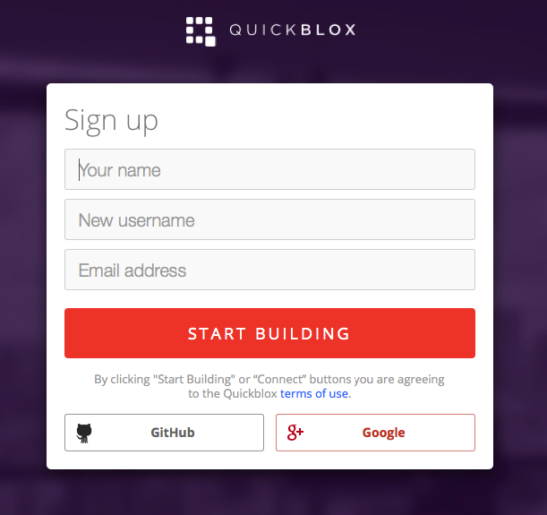
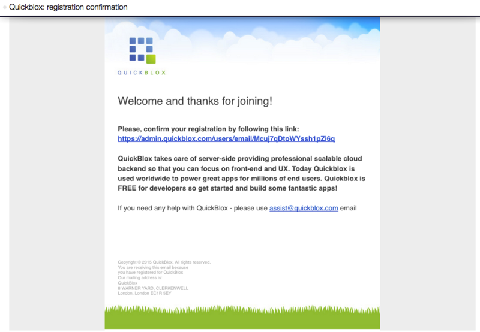
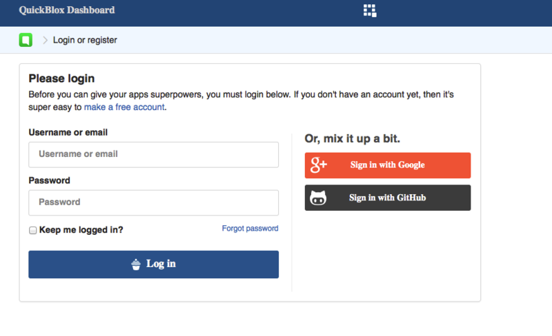
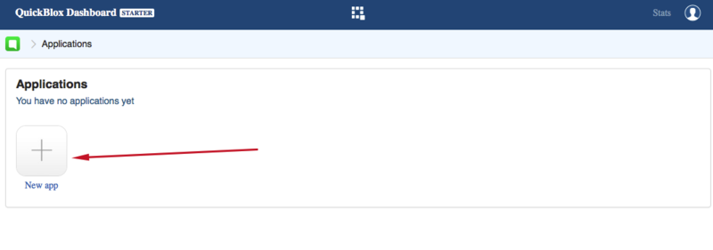
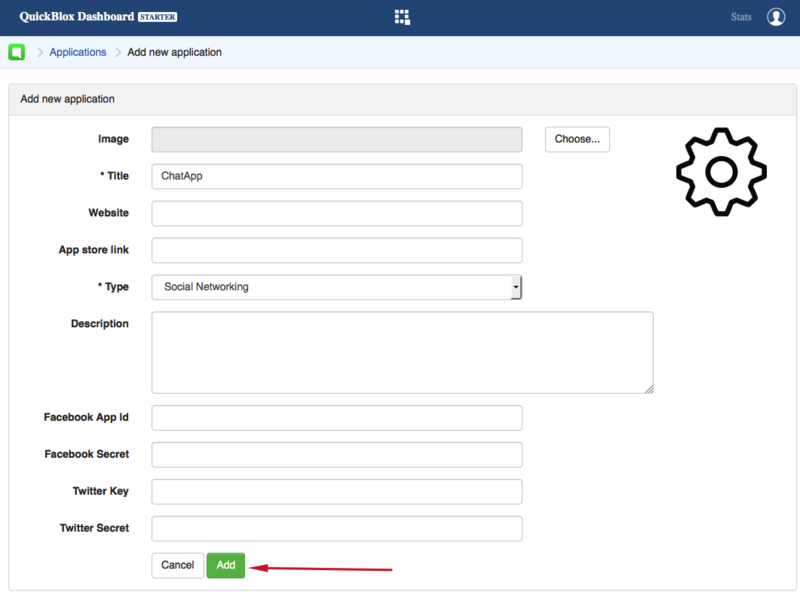
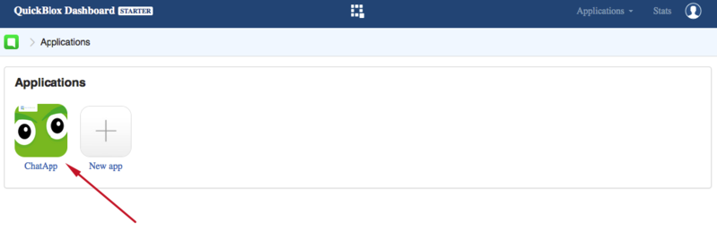

Welcome to QuickBlox, where you can get your cloud communication backend running in just 5 minutes! All you need is to:

1. Register a free QuickBlox account and add your App there.
2. Download SDK / code sample for your platform.
3. Update credentials in your application code.
 

Detailed instructions are below.

# Create your QuickBlox account

Go to [https://admin.quickblox.com]() and click on “Register” at the top or just follow the link: [https://admin.quickblox.com/register]().

Note: you need to accept the **Terms and Conditions** in order to proceed. To read the Terms and Conditions just follow the link next to the checkbox.

Click on the button **Start Building** at the bottom of the page. You will receive a confirmation e-mail shortly. Confirm your registration by following the link in the e-mail.

Congratulations! You've been registered!

# Sign in to Dashboard

Follow the link [https://admin.quickblox.com/signin](https://admin.quickblox.com/signin), enter your Login and Password and click on the Sign In Now button.

# Create your first application

Upon sign in you will see the main page where you need to find the "Add new application" button and click on it.

Next step is to fill the "Add new application" form. Here you need to enter the information such as the title of your app, its website, type (game, fun, office, productivity and other are possible) and description. **Note**: Fields "Title" and "Type" are mandatory, others are optional.

Click on the button "Add" in the bottom. The app will appear in the list of your apps.

Click on app title to view/edit its credentials.

You will see the auto-generated values of the **application id**, **authorization key** and **authorization secret**. These are important - your app needs to use these credentials so that server knows who's there. Also, go to [https://admin.quickblox.com/account/settings](https://admin.quickblox.com/account/settings) and copy your **account id**.

**Note**: You may also see modules icons: **Chat, Users, Push Notifications, Content, Custom Objects, Location** - feel free to click on them and experiment with admin panels for those features.

