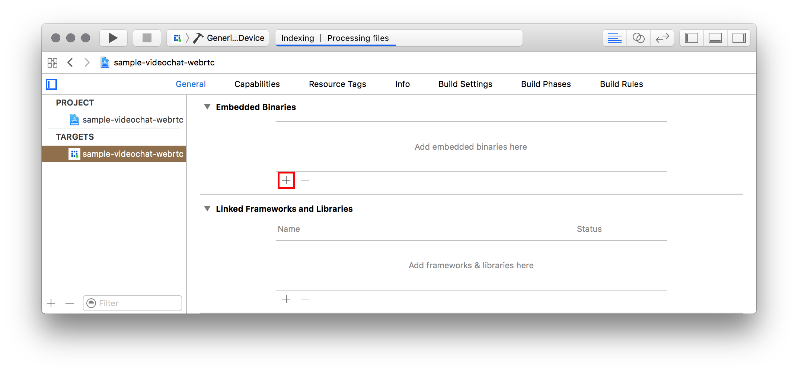

QuickBlox - Communication & cloud backend (BaaS) platform which brings superpowers to your mobile apps.

<span id="Features" class="on_page_navigation"></span>
# Features
Authentication, Users, Chat, Custom Objects,

<span id="Requirements" class="on_page_navigation"></span>
# Requirements
+ iOS 8.0+
+ Xcode 8.0+
+ Swift 3.0+

<span id="Migration_Guides" class="on_page_navigation"></span>
# Migration Guides
+ From version 1.9 to 2.0

<span id="Communication" class="on_page_navigation"></span>
# Communication
+ If you need help, use Stack Overflow. (Tag 'Quickblox')
+ If you'd like to ask a general question, use Stack Overflow.
+ If you found a bug, open an issue.
+ If you have a feature request, open an issue.
+ If you want to contribute, submit a pull request

<span id="Installation" class="on_page_navigation"></span>
# Installation
## CocoaPods
CocoaPods is a dependency manager for Cocoa projects. You can install it with the following command:
```
$ gem install cocoapods
```
> CocoaPods 1.1.0+ is required to build Quickblox SDK

To integrate `Quickblox Framework` into your `Xcode` project using `CocoaPods`, specify it in your `Podfile`:

``` ruby
source 'https://github.com/CocoaPods/Specs.git'
platform :ios, '8.0'
use_frameworks!

target '<Your Target Name>' do
    pod 'QuickBlox', '~> 3.0'
end
```
Then, run the following command:

```
$ pod install
```

## Manually
If you prefer not to use either of the aforementioned dependency managers, you can integrate `Quickblox framework` into your project manually.
### Embedding a framework
1. Open the app’s Xcode project or workspace.
2. Go to the app target’s General configuration page.
3. Add the framework target to the Embedded Binaries section by clicking the Add icon, highlighted in Figure 3. Do not drag in the framework from Finder.
4. Select your framework from the list of binaries that can be embedded.

<center> <b>Figure 1:</b>  Click the Add button to embed a framework </center>



# Other Quickblox Projects

+ Q-municate app for iOS
+ Services
+ Chat UI for iOS
+ QBCallKit for iOS

<span id="License" class="on_page_navigation"></span>
# License
```
```
