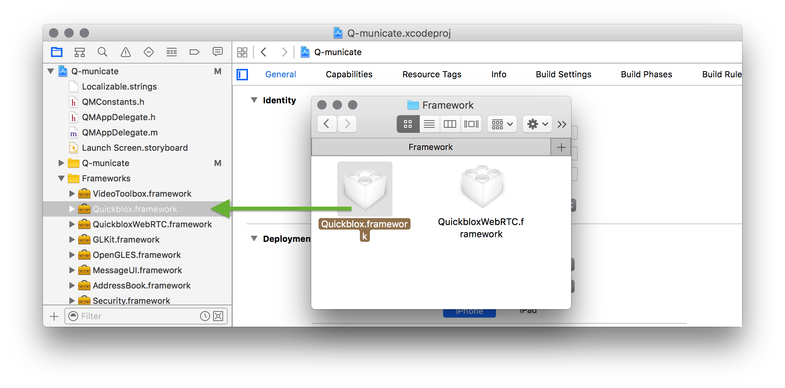
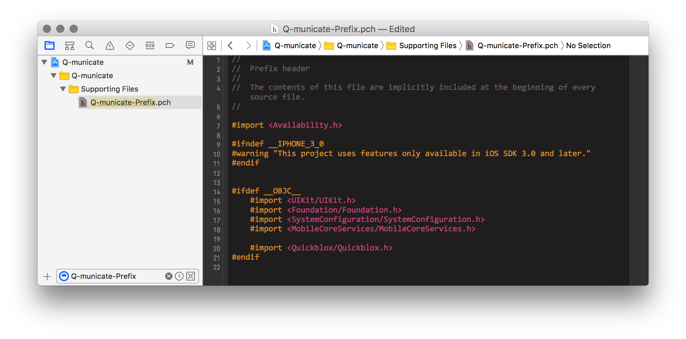
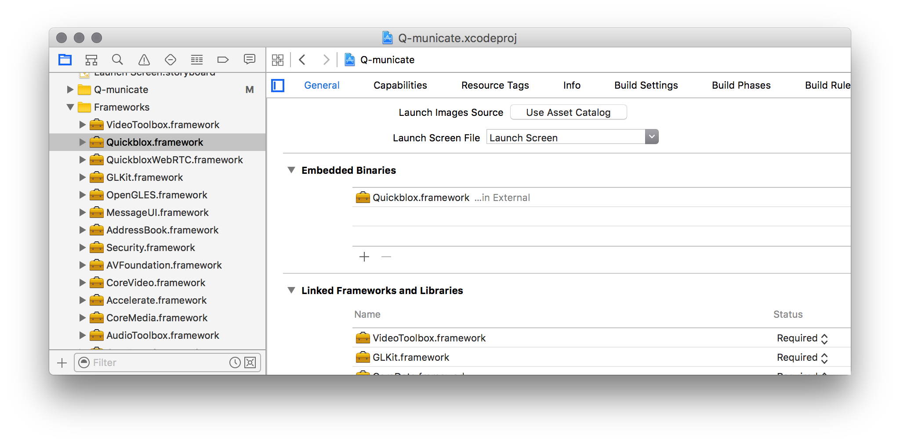
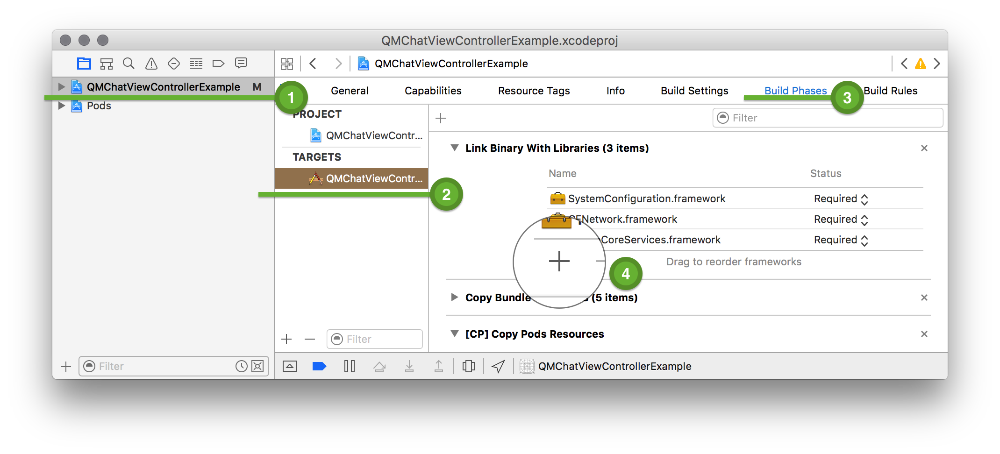

<span id="Connecting_QuickBlox_Framework_with_Your_Project" class="on_page_navigation"></span>
# Connecting QuickBlox Framework with Your Project

There are 2 ways of adding Quickblox framework:
##CocoaPods
Make sure that you have [CocoaPods](https://cocoapods.org) installed.
Open your **Podfile** and add following line for dynamic framework (iOS 8+): 

``` ruby
pod 'QuickBlox'
```

Add [the following script]() for dynamic framework.

Or add following line for static framework (iOS 7+): 

``` ruby
pod 'QuickBlox-static'
```

That's all! Now you have connected Quickblox Framework to Your Project.
##Manual installation

1. Download [iOS SDK, version 2.7.6](https://github.com/QuickBlox/quickblox-ios-sdk/archive/master.zip)
2. Unzip the file. Open Framework folder - inside it you will see 
**Quickblox.framework** file.
3. Open existing or create a new project in Xcode
4. Drag & drop **Quickblox.framework** folder to Frameworks folder in your Xcode project:

5. Add `#import <Quickblox/Quickblox.h>` to ***-Prefix.pch** file:

6. Link with CFNetwork, SystemConfiguration, MobileCoreServices, CoreGraphics, CoreLocation, CoreData, AudioToolbox, CoreMedia, Accelerate, CoreVideo, AVFoundation, Security, libz, libresolv, libxml frameworks:
Open the settings for your target by clicking on the blue bar at the top of the Xcode sidebar:
7. Add `-lxml2`, `-ObjC`, `-lstdc++` flags to **Other Linker Flags** section in project settings

8. Link with `SystemConfiguration`, `MobileCoreServices`, `CFNetwork`, `libxml` frameworks. The screenshot shows the **QMChatViewControllerExamle** project selected in the project navigator.

 
 
###Steps
1 Select the name of the project in the project navigator.
The project editor appears in the editor area of the Xcode workspace window.