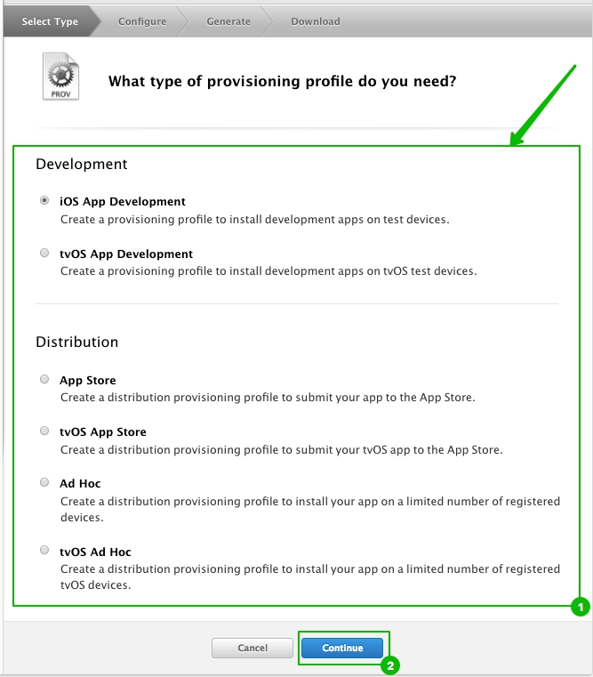
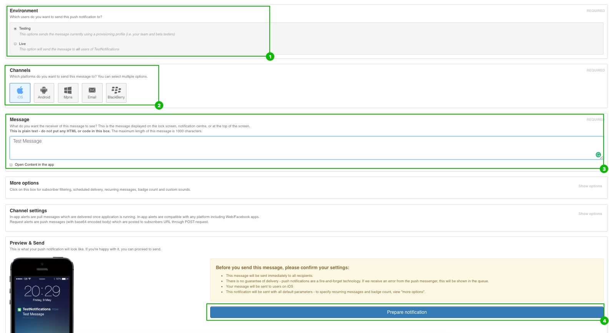

There are 2 ways that you can integrate Push Notifications into your app:

1. **Broadcasting the same message to all users.** It's a simple method which can be used in informational apps that do not authenticate users and where same push notification messages are broadcasted to everybody. This way when you want to send a push message you may 1) simply go to Admin panel -> Push Notifications -> type your message in Simple mode -> and hit "Send" for all of your users to receive the message; Send a push using Push Notifications API (explained below). Following this way you only need to create ONE QuickBlox User which will have all of your users' devices associated with it. Then simply send your pushes to that User.
2. **Send individual push alerts.** This is when you want to individually send push notifications to a particular user or a group of users (for example notify users of a new chat message sent while they are offline or tell them about some deal/event happening in close proximity to their location). Following this way you need to have a QuickBlox User created for each of your app users. Note that there are easy ways to transparently create QB Users along with your existing users authentication system or have them sign up with Facebook/Twitter/OAuth (described in Users code sample reference) so your end users don't have to type any additional login credentials or know anything about QuickBlox.

<span id="Create_APNS_certificates" class="on_page_navigation">
</span>

# Create APNS certificates

Each iOS application that uses Apple Push Notifications must have APNS certificates uploaded via the Admin panel. To get the information on how to create APNS certificates and upload them to Admin panel, please, refer to the [How to create APNS certificates page.]()

## Creating an App ID

Each iOS application that uses the Apple Push Notifications must have a unique application ID that uniquely identifies itself. The following steps describe how to create an Apple App ID for your application.
>If you already have an App ID you can skip this steps

1. Log in to the [iPhone Developer Connection Portal](https://developer.apple.com/account/)

2. Click on the **Certificates, IDs & Profiles**:


3. To make a new App ID open the App IDs tab and click on the New App ID button:


4. Enter your app name for the **Description (1)**. Enter **Bundle Identifier(2)**.
 Ensure you have created an App ID without a wildcard. Wildcard IDs cannot use the push notification service. For example, our iOS application ID looks something like *com.quickblox.notificationstest*. Click **Continue**:


5. You should now see the info about App ID that you have created. Click **Register** button to continue.

 ## Generating a Certificate Request

 You must generate a certificate request file so that you can use it to request for a development SSL certificate later on.

 1. Launch the Keychain Access application in your Mac OS:
 

 2. Select Keychain Access -> Certificate Assistant -> Request a Certificate From a Certificate Authority:
 

 3. Enter the information required and check the **'Saved to disk'** option. Click Continue:
 

 4. Save the certificate request using the suggested name and click **Save**. Click **Done** in the next screen:
 

>The same process above applies when generating the production certificate.

## Configuring an App ID for Push Notifications

Once an App ID is created, you need to configure it for push notifications.

1. To configure an App ID for push notification, you need to select the App in the App IDs list. Under Application Services: click on the **'Edit'** button for the selected App ID:


2. Configuration page opens. Scroll down to Push Notifications. Enable checkbox**(1)** and click the **'Create Certificate'(2)** button.


3. A wizard will appear. Click **Continue**:


4. Click the **'Choose File...'** button to locate the Certificate Request file that you have saved earlier *(Generating a Certificate Request section)*. Click **Generate**:


5. Your SSL Certificate will now be generated. Click **Download** and save it on your hard dick:


Alternative way for downloading created certificate:

> The same process above applies when generating the production certificate.

## Making APNS certificates

1. The SSL Certificate that you download is named **aps_developer_identity.cer**. Double-click on it to install it in the Keychain Access application. The SSL certificate will be used by your provider application so that it can contact the APNs to send push notifications to your applications.

2. Launch Keychain Assistant from your Mac and from the 'login' keychain, filter by the 'Certificates' category. You will see an expandable option called “Apple Development iOS Push Services”, paired with a private key:


3.Right-click on your new push certificate and choose **Export “Apple Development iOS Push Services ...″**. Save this as apns-dev-cert.p12 file somewhere you can access it.

Enter the password for exporting (optional):


Enter your usual admin password for your computer to confirm and finalize the export process:


> The same process above applies when generating the production certificate.


## Upload certificate to Admin panel
**Thats all! Now you can upload APNS certificates to Push notifications module in [QuickBlox Admin panel.](https://admin.quickblox.com/signin)**

1. Go to Push notifications


2. Switch to Settings tab.

 * Choose certificate enviroment (1).
 * Enter password if certificate has it (2).
 * Choose certificate with p12 format (3).

3. Upload your certificate.

## Creating provision profile
1. Log in to the [iPhone Developer Connection Portal](https://developer.apple.com/account/)

2. Click on the **Certificates, IDs & Profiles**:


3. Open Provisioning profiles tab. Click on the 'Create a new provision profile' button:


4. Select a type of the provisioning profile you need to create (1) and click on 'Continue' button to continue the creation:


5. Select App ID you are creating the provisioning profile for:


6. Select the certificates you wish to include in this provisioning profile and click on 'Continue' button:


7. Select the devices you wish to include in this provisioning profile and click on 'Continue' button:


8. Input the Provisioning profile name and click on 'Continue' button to generate the profile:


9. After the generating of the Provisioning Profile was finished screen with the info and available options appears. Click on 'Download' button to download the Provisioning profile:


>Also you can download the Provisioning profile later. Open a list with all Provisioning profiles and choose the required. Additional options become available:


10. After click on 'Download' button the Provision profile will be downloaded to your hard disk.Double click on it:


## Configuring an App for Push Notifications

1. The first step is to change the App ID. Go to App Settings -> General and change Bundle Identifier to identifier that you type on [Step 1]():


2. Then in the section named "Singing (Debug or Release)" select your Provision Profile


3. Go to App Settings -> Capabilities and flip the switch for Push Notifications to On.


>If you are using Xcode version prior to 8 you can go to **Build Settings**  and find (or search for) the "Code Signing Identity" field. Then in the section named "Provision Profile" select your Provision Profile:


## Registering for Push Notifications

1. To register the current device for push, call UIApplication's registerForRemoteNotifications method from the app delegate's application:didFinishLaunchingWithOptions: (typically AppDelegate.m or AppDelegate.swift).

2. To register the current device for push, call `UIApplication`'s `registerForRemoteNotifications` method from the app delegate's `application:didFinishLaunchingWithOptions:` (typically `AppDelegate.m` or `AppDelegate.swift`).

```objective-c
// Objective-C
- (BOOL)application:(UIApplication *)application didFinishLaunchingWithOptions:(NSDictionary *)launchOptions {
  ...

  UIUserNotificationType userNotificationTypes = (UIUserNotificationTypeAlert |
                                                  UIUserNotificationTypeBadge |
                                                  UIUserNotificationTypeSound);
  UIUserNotificationSettings *settings = [UIUserNotificationSettings settingsForTypes:userNotificationTypes
                                                                           categories:nil];
  [application registerUserNotificationSettings:settings];
  [application registerForRemoteNotifications];
  ...
}
```
```swift
// Swift
func application(application: UIApplication, didFinishLaunchingWithOptions launchOptions: [NSObject: AnyObject]?) -> Bool
    {
    ...
    let userNotificationTypes: UIUserNotificationType = [.Alert, .Badge, .Sound]
    let settings = UIUserNotificationSettings(forTypes: userNotificationTypes, categories: nil)
    application.registerUserNotificationSettings(settings)
    application.registerForRemoteNotifications()
    ...
    }
```

3. If the registration is successful, the callback method `application:didRegisterForRemoteNotificationsWithDeviceToken:` in the application delegate will be executed.

```objective-c
// Objective-C
- (void)application:(UIApplication *)application didRegisterForRemoteNotificationsWithDeviceToken:(NSData *)deviceToken {

}
```

```swift
// Swift
func application(application: UIApplication, didRegisterForRemoteNotificationsWithDeviceToken deviceToken: NSData) {

}
```

4. Build and run. When the app launches, you should receive a prompt that asks for permission to send you notifications:


5. If the user accepts, iOS will call your application delegate's application:didRegisterForRemoteNotificationWithDeviceToken: method, passing in the APNs device token. It is a token provided by APNS that uniquely identifies this app on this particular device. When sending a push notification, the app uses device tokens as “addresses” to direct notifications to the correct devices. Add the following code to AppDelegate:

```objective-c

// Objective-C
- (void)application:(UIApplication *)application didRegisterForRemoteNotificationsWithDeviceToken:(NSData *)deviceToken {
    NSString *deviceIdentifier = [[[UIDevice currentDevice] identifierForVendor] UUIDString];

    // subscribing for push notifications
    QBMSubscription *subscription = [QBMSubscription subscription];
    subscription.notificationChannel = QBMNotificationChannelAPNS;
    subscription.deviceUDID = deviceIdentifier;
    subscription.deviceToken = deviceToken;

    [QBRequest createSubscription:subscription successBlock:nil errorBlock:nil];
}
```

```swift
// Swift
func application(_ application: UIApplication, didRegisterForRemoteNotificationsWithDeviceToken deviceToken: Data) {

    let deviceIdentifier: String = UIDevice.current.identifierForVendor!.uuidString
    let subscription: QBMSubscription! = QBMSubscription()

    subscription.notificationChannel = QBMNotificationChannel.APNS
    subscription.deviceUDID = deviceIdentifier
    subscription.deviceToken = deviceToken
    QBRequest.createSubscription(subscription, successBlock: { (response: QBResponse!, objects: [QBMSubscription]?) -> Void in
        //
    }) { (response: QBResponse!) -> Void in
        //
    }
}
```

# Sending Push Notifications
QuickBlox provides several solutions for triggering the delivery of push notifications. You may use any combination of the following methods as needed to fit your app's use case.

## Sending Push Notifications from the Admin panel
1. Go to [QuickBlox Admin panel](https://admin.quickblox.com/signin) and choose 'Push notifications' section:


2. Choose Environment (1), Channel(2), type the message(3) and press the 'Prepare Notification' button(4):


3. Your message will be delivered to all subscribed Users. You will see:


4. If you've installed the app on a device, you should see the notification appear within a few seconds.


>You won’t see anything if the app is open and running in the foreground. The notification is delivered, but there’s nothing in the app to handle it yet. Simply close the app and send the notification again.


## Sending Push Notifications from application (via API)
It's possible to send 2 types of push notifications:
1. Platform based Push Notifications
2. Universal push notifications

### Platform based Push Notifications

Send Platform based push notifications (APNS) (only works for iOS mobile and Safari desktop). Platform based push notification will be delivered to **specified platform only** - in our case it's iOS mobile and Safari desktop:

1. Send Push Notification to particular users (through their IDs):

```objective-c
// Objective-C
- (void)application:(UIApplication *)application didRegisterForRemoteNotificationsWithDeviceToken:(NSData *)deviceToken {
    NSString *deviceIdentifier = [[[UIDevice currentDevice] identifierForVendor] UUIDString];

    // subscribing for push notifications
    QBMSubscription *subscription = [QBMSubscription subscription];
    subscription.notificationChannel = QBMNotificationChannelAPNS;
    subscription.deviceUDID = deviceIdentifier;
    subscription.deviceToken = deviceToken;

    [QBRequest createSubscription:subscription successBlock:nil errorBlock:nil];
}
```

```swift

// Swift
func application(_ application: UIApplication, didRegisterForRemoteNotificationsWithDeviceToken deviceToken: Data) {

    let deviceIdentifier: String = UIDevice.current.identifierForVendor!.uuidString
    let subscription: QBMSubscription! = QBMSubscription()

    subscription.notificationChannel = QBMNotificationChannel.APNS
    subscription.deviceUDID = deviceIdentifier
    subscription.deviceToken = deviceToken

    QBRequest.createSubscription(subscription, successBlock: { (response: QBResponse!, objects: [QBMSubscription]?) -> Void in
        //
    }) { (response: QBResponse!) -> Void in
        //
    }
}

2. Send push notification to a group of users (via Tags):

```objective-c
// Objective-C
NSString *mesage = @"Hello man!";
NSMutableDictionary *payload = [NSMutableDictionary dictionary];
NSMutableDictionary *aps = [NSMutableDictionary dictionary];
[aps setObject:@"default" forKey:QBMPushMessageSoundKey];
[aps setObject:mesage forKey:QBMPushMessageAlertKey];
[payload setObject:aps forKey:QBMPushMessageApsKey];

QBMPushMessage *pushMessage = [[QBMPushMessage alloc] initWithPayload:payload];

// Send push to groups 'man' and 'car'
[QBRequest sendPush:pushMessage toUsersWithAnyOfTheseTags:@"man,car" successBlock:^(QBResponse *response, QBMEvent *event) {
    // Successful response with event
} errorBlock:^(QBError *error) {
    // Handle error
}];
```

```swift
// Swift

let message = "Hello man!"
var payload = [String: AnyObject]()
var aps = [String: AnyObject]()

aps[QBMPushMessageSoundKey] = "default" as AnyObject!
aps[QBMPushMessageAlertKey] = message as AnyObject!
payload[QBMPushMessageApsKey] = aps as AnyObject!

let pushMessage = QBMPushMessage.init()
pushMessage.payloadDict = NSMutableDictionary(dictionary: payload)

// Send push to groups 'man' and 'car'
QBRequest.sendPush(pushMessage, toUsersWithAnyOfTheseTags: "man,car", successBlock: {(response: QBResponse,event: QBMEvent?) -> Void in
    // Successful response with event
}, errorBlock: {(error: QBError?) -> Void in
    // Handle error
})
```

### Universal push notifications
Universal push notifications will be delivered to all possible platforms and devices for specified users. With universal push notifications there are 2 ways to send it:

1. Just send a simple push with text only:

```objective-c
// Objective-C

// Send push to users with ids 292,300,1295
[QBRequest sendPushWithText:@"Hello world" toUsers:@"292,300,1295" successBlock:^(QBResponse *response, QBMEvent *event) {
    // Successful response with event
} errorBlock:^(QBError *error) {
    // Handle error
}];
```

```swift

// Swift
QBRequest.sendPush(withText:"Hello world", toUsers: "292,300,1295", successBlock: {(response: QBResponse!, event: [QBMEvent]?) -> Void in
    // Successful response with even
}, errorBlock: {(error: QBError?) -> Void in
    // Handle error
})
```

2. With custom parameters:

```objective-c

// Send push to users with ids 292,300,1295
QBMEvent *event = [QBMEvent event];
event.notificationType = QBMNotificationTypePush;
event.usersIDs = @"292,300,129";
event.type = QBMEventTypeOneShot;

// standart parameters
// read more about parameters formation http://quickblox.com/developers/Messages#Use_custom_parameters
//
NSMutableDictionary  *dictPush = [NSMutableDictionary  dictionary];
[dictPush setObject:@"Message received from Bob" forKey:@"message"];
[dictPush setObject:@"5" forKey:@"ios_badge"];
[dictPush setObject:@"mysound.wav" forKey:@"ios_sound"];

// custom params
[dictPush setObject:@"234" forKey:@"user_id"];
[dictPush setObject:@"144" forKey:@"thread_id"];

NSError *error = nil;
NSData *sendData = [NSJSONSerialization dataWithJSONObject:dictPush options:NSJSONWritingPrettyPrinted error:&error];
NSString *jsonString = [[NSString alloc] initWithData:sendData encoding:NSUTF8StringEncoding];
//
event.message = jsonString;

[QBRequest createEvent:event successBlock:^(QBResponse * _Nonnull response, NSArray<QBMEvent *> * _Nullable events) {
    // Successful response with event
} errorBlock:^(QBResponse * _Nonnull response) {
    // Handle error
}];
```

```swift
//Swift
// Send push to users with ids 292,300,1295
let event = QBMEvent.init()
event.notificationType = .push
event.usersIDs = "292,300,129"
event.type = .oneShot

// standart parameters
// read more about parameters formation http://quickblox.com/developers/Messages#Use_custom_parameters
//
var dictPush = [String : String]()

dictPush["message"] = "Message received from Bob"
dictPush["ios_badge"] = "5"
dictPush["ios_sound"] = "mysound.wav"

// custom params
dictPush["user_id"] = "234"
dictPush["thread_id"] = "144"

let jsonData = try? JSONSerialization.data(withJSONObject: dictPush, options: .prettyPrinted)
let jsonString = String(bytes: jsonData!, encoding: String.Encoding.utf8)

event.message = jsonString

QBRequest.createEvent(event, successBlock: {(response: QBResponse,events: [QBMEvent]?) -> Void in
    // Successful response with event
}, errorBlock: {(response: QBResponse) -> Void in
    // Handle error
})
```

> read more [about parameters formation](http://quickblox.com/developers/Messages#Use_custom_parameters)

## Adding Rich Push Notifications to your application
Rich Push Notifications allow you to deliver some rich media content (images, video, HTML/CSS/Javascript) to your users. This works as a combination of QB Push Notifications and [QB Content APIs](http://quickblox.com/developers/Content).

1. Go to Content module page on Admin panel, сhoose any image on your hard disk and press Upload button:


2. While creating the push notification message body, press 'Add Content' button:


3. Check your uploaded image and press 'Add Selected' button:


4. The image will be connected to the Push Notifications. Finally, choose **Environment**, **Channel**, type your message body and press the '**Prepare Notification**' button.


# Handling Push Notifications

## Anatomy of a Basic Push Notification
A push notification is a short message that consists of the device token, a payload, and a few other bits and bytes. The payload is what you are interested in, as that contains the actual data you need.
The payload for a simple push message looks like this:

```
{
    aps =     {
        alert = "Hello everyone!!!";
        sound = default;
    };
}
```

For the JSON uninitiated, a block delimited by curly { } brackets contains a dictionary that consists of key/value pairs (just like an NSDictionary).

The payload is a dictionary that contains at least one item, “aps”, which itself is also a dictionary. In our example, “aps” contains the fields “alert” and “sound”. When this push notification is received, it shows an alert view with the text "Hello everyone!!!" and plays the standard sound effect.

There are five keys you can add to the aps dictionary:
- **alert**. This can be a string, like in the previous example, or a dictionary itself. As a dictionary, it can localize the text or change other aspects of the notification. See [Apple’s documentation](https://developer.apple.com/library/content/documentation/NetworkingInternet/Conceptual/RemoteNotificationsPG/PayloadKeyReference.html#//apple_ref/doc/uid/TP40008194-CH17-SW1) for all the keys it can support.
- **badge**. This is a number that will display in the corner of the app icon. You can remove the badge by setting this to 0.
- **sound**. By setting this key, you can play custom notification sounds located in the app in place of the default notification sound. Custom notification sounds must be shorter than 30 seconds and have a few restrictions, which you can see in [Apple’s documentation]().
- **content-available**. By setting this key to 1, the push notification becomes a silent one.
- **category**. This defines the category of the notification, which is is used to show custom actions on the notification.

Outside of these, you can add as much custom data as you want, **as long as the payload does not exceed the maximum size**. Custom values must use the JSON structured and primitive types: dictionary (object), array, string, number, and Boolean.

>Custom payload values should be specified outside the Apple-reserved aps namespace

```
{
    "aps" : {
        "alert" : {
            "title" : "New message",
            "body" : "I like Quickblox!"
        },
        "badge" : 5,
        "sound" : "bingbong.aiff"
    },
    "acme1" : "bar",
    "acme2" : [ "bang",  "whiz" ]
}
```

Now “alert” is a dictionary of its own. The “badge” field contains the number that will be shown on the application icon. This notification will play a custom sound named "bingbong.aiff".
This examples also includes keys whose names include the string “acme”, which represent custom data.

> In iOS 8 and later, the maximum size allowed for a notification payload is 2 kilobytes; Apple Push Notification service refuses any notification that exceeds this limit. (Prior to iOS 8 and in OS X, the maximum payload size is 256 bytes.)

## Deal with it!
When your app receives a push notification, a method in UIApplicationDelegate is called.
The notification needs to be handled differently depending on what state your app is in when it’s received:

| Device / Application State           	| Notification workflow                                                                                                                                  	| Delegate method                                   	|
|-------------------------------------	|--------------------------------------------------------------------------------------------------------------------------------------------------------	|-----------------------------------------------	|
| Device is off                       	| Most recent notification stored  in a queue and may be delivered device is turned on (no guarantee).                                                   	|  -                                            	|
| Device is on / App is in background 	| Notifications is displayed. Style of the notification is based on user preferences and settings.                                                       	| application(_:didReceiveRemoteNotification:)  	|
| Device is on / App is in foreground 	| Notification is received by app, but not automatically displayed. Code must be written to display notification.                                         	|  application(_:didReceiveRemoteNotification:) 	|
| Device is on / App is not running   	| If your app wasn’t running and the user launches it by tapping the push notification, the push notification is passed to your app in the launchOptions 	| application(_:didFinishLaunchingWithOptions:) 	|

- (void)application:(UIApplication *)application didReceiveRemoteNotification:(NSDictionary *)userInfo
{
    NSLog(@"New push: %@", userInfo);
}

## Push Notifications in iOS 10

The new framework called “**UserNotifications**”	is introduced with iOS 10 SDK. The [UserNotifications framework](https://developer.apple.com/reference/usernotifications) (UserNotifications.framework) supports the delivery and handling of local and remote notifications.

1. Add UserNotifications.framework


2. Import UserNotifications.framework in your AppDelegate file and add UNUserNotificationCenterDelegate.

```objective-c
#import <UserNotifications/UserNotifications.h>
//...
@interface AppDelegate () <UNUserNotificationCenterDelegate>

@end
//...
```

```swift
import UserNotifications
//...
class AppDelegate: UIResponder, UIApplicationDelegate, UNUserNotificationCenterDelegate {
//...
```
3. Register for push notification
Before registration check the version of iOS and then add code base on versions
Add code in your did finish launching:

```objective-c

#define SYSTEM_VERSION_GREATER_THAN_OR_EQUAL_TO(v)  ([[[UIDevice currentDevice] systemVersion] compare:v options:NSNumericSearch] != NSOrderedAscending)

-(BOOL)application:(UIApplication *)application didFinishLaunchingWithOptions:(NSDictionary *)launchOptions{
    [self registerForRemoteNotifications];
    return YES;
}

- (void)registerForRemoteNotifications {
    if(SYSTEM_VERSION_GRATERTHAN_OR_EQUALTO(@"10.0")){
        UNUserNotificationCenter *center = [UNUserNotificationCenter currentNotificationCenter];
        center.delegate = self;
        [center requestAuthorizationWithOptions:(UNAuthorizationOptionSound | UNAuthorizationOptionAlert | UNAuthorizationOptionBadge) completionHandler:^(BOOL granted, NSError * _Nullable error){
             if(!error){
                 [[UIApplication sharedApplication] registerForRemoteNotifications];
             }
         }];
    }
    else {
        // Code for old versions
    }
}
```

```swift
func application(_ application: UIApplication, didFinishLaunchingWithOptions launchOptions: [UIApplicationLaunchOptionsKey: Any]?) -> Bool {
    // Override point for customization after application launch.
    registerForRemoteNotification()
    return true
}

func registerForRemoteNotification() {
    if #available(iOS 10.0, *) {
        let center  = UNUserNotificationCenter.current()
        center.delegate = self
        center.requestAuthorization(options: [.sound, .alert, .badge]) { (granted, error) in
            if error == nil{
                UIApplication.shared.registerForRemoteNotifications()
            }
        }
    }
    else {
        UIApplication.shared.registerUserNotificationSettings(UIUserNotificationSettings(types: [.sound, .alert, .badge], categories: nil))
        UIApplication.shared.registerForRemoteNotifications()
    }
}
```
4. Handling delegate methods for UserNotifications
There are two delegate methods need to be handled :

```objective-c
//Called when a notification is delivered to a foreground app.
-(void)userNotificationCenter:(UNUserNotificationCenter *)center willPresentNotification:(UNNotification *)notification withCompletionHandler:(void (^)(UNNotificationPresentationOptions options))completionHandler{
    NSLog(@"User Info : %@",notification.request.content.userInfo);
    completionHandler(UNAuthorizationOptionSound | UNAuthorizationOptionAlert | UNAuthorizationOptionBadge);
}

//Called to let your app know which action was selected by the user for a given notification.
-(void)userNotificationCenter:(UNUserNotificationCenter *)center didReceiveNotificationResponse:(UNNotificationResponse *)response withCompletionHandler:(void(^)())completionHandler{
    NSLog(@"User Info : %@",response.notification.request.content.userInfo);
    completionHandler();
}
```

```swift
//Called when a notification is delivered to a foreground app.
@available(iOS 10.0, *)
func userNotificationCenter(_ center: UNUserNotificationCenter, willPresent notification: UNNotification, withCompletionHandler completionHandler: @escaping (UNNotificationPresentationOptions) -> Void) {
    print("User Info = ",notification.request.content.userInfo)
    completionHandler([.alert, .badge, .sound])
}

//Called to let your app know which action was selected by the user for a given notification.
@available(iOS 10.0, *)
func userNotificationCenter(_ center: UNUserNotificationCenter, didReceive response: UNNotificationResponse, withCompletionHandler completionHandler: @escaping () -> Void) {
    print("User Info = ",response.notification.request.content.userInfo)
    completionHandler()
}
```
# Preparing for the App Store

You've configured your app to receive push notifications during development. Prior to submitting your app to the App Store, you will need to configure push notifications for distribution.

There are two types of distribution profiles: Ad Hoc, and App Store. You will need the latter to submit your app to the App Store, however it is good practice to test push notifications using an Ad Hoc profile prior to submitting your app.

## Configuring your App for Distribution Push Notifications

In Section 1.3., you configured your App ID for Push Notifications in Development. Retrace steps 1 through 7, but select "Production Push SSL Certificate" in step 2 instead.

Your App ID should now be configured for both Development and Distribution push notifications. Make sure to download the new Production SSL Certificate from the App ID Settings screen.

Configured for Development and Distribution
Double click on the downloaded SSL certificate to install it in your keychain. Right-click on it and export it as a .p12 file. Again, don't enter an export password when prompted.

Go back to Section 2 and retrace steps 1 through 10, making sure to select "Ad Hoc" under Distribution in Step 4. You should also use a different name in Step 8, such as "Test Notifications Ad Hoc Profile". This should help you distinguish between development and distribution profiles.

Retrace the steps from Section 3, and upload your exported Production .p12 certificate to admin panel instead.

In Section 4, you configured your app to use a Development provisioning profile. Retrace your steps, but this time choose your new Distribution Ad Hoc provisioning profile instead.

Build and run your app on an iOS device. Verify that push notifications are delivered successfully.

Note that once you have uploaded a production push certificate to Quickblox admin panel, you will only be able to target devices using a distribution provisioning profile. Devices running an app signed with a development provisioning profile will need to install the newly provisioned build again.

## Configuring your App for App Store Distribution

You have now confirmed that your app is configured correctly to receive distribution push notifications using an Ad Hoc provisioning profile. Now it's time to submit your app to the App Store.

Follow steps 1 through 10 from Section 2, making sure to select "App Store" under Distribution for Step 4. Note that this time around, since you will be submitting your app to the App Store, you can skip Step 7 (selecting test devices).

Go through Section 4 again, this time selecting your new App Store Distribution provisioning profile.

Build and archive your iOS app, then submit to the App Store.
