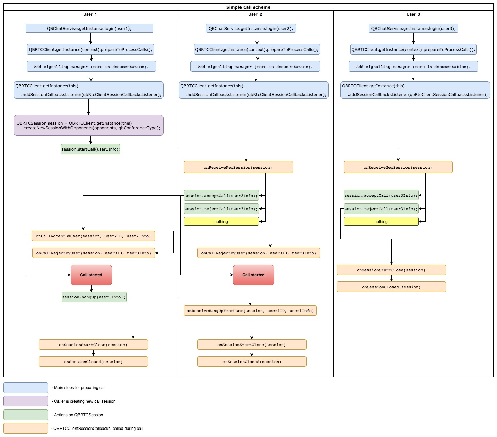

<span id="Overview" class="on_page_navigation"></span>
# Overview

## Main features:
Quickblox Android SDK has all needed functionality to implement video and audio calls to application and easily allows to add it to your project.

There are two approaches for WebRTC audio/video calls implementation in QuickBlox:
- Client side (Peer-to-peer or Mesh) - available for all customers;
- Server side  (SFU) implementation - available for Enterprise customers (additional server is needed to be set up);


You can use the following features of SDK with MESH scheme:
* audio calls;
* video calls;
* peer-to-peer call (1-1 private calls);
* group calls(stable connection is supported with 10 participants for audio call and 6 participants for video);
* support logic of calls to participants, who are currently not logged into app and not logged into the chat (using Push notifications module);
* support of popular audio codecs (opus, ISAC);
* support of popular video codecs (VP8, VP9, H264);
* screensharing (possibility to demonstrate the screen of your device not only from current app, but from whole system);
* Arbitrary placement of UI elements on call screen.

Additionally, Enterprise customers could purchase server to use SFU scheme, which allows:
* increase the number of participants to 12;
* manage opponents during the call(on server side);
* join existing call;

## System requirements
Quickblox Android video chat webrtc sdk supports:
* armeabi, armeabi-v7a, armeabi64-v8a, and x86 architectures.
* Android 4.3+ (Jelly Bean MR2, API Level 18). SDK is expected to work with Android 4.1+ (Jelly Bean, API Level 16), 
but on such devices can be problems with video quality.
* devices from Samsung, Google, Motorola Moto, and LG Optimus families. And other official android devices like Nexus family.
* Wi-Fi and 4G LTE networks.

<span id="Prepare_your_application_for_QuickBlox_Android_SDK" class="on_page_navigation"></span>
## Prepare your application for Android SDK
The instruction below assumes you are aware of Quickblox integration process and have already performed the following actions:

* [Created QuickBlox account](http://admin.quickblox.com/register)
* [Registerer an application in Dashboard](http://quickblox.com/developers/5_Mins_Guide)
* [Integrated QuickBlox SDK into application - stub link]()

The following steps describe how to integrate the **call module** into your android application:

* add dependencies to maven repository with **calls module**;
* add native libraries, needed for proper work of SDK;
* add needed permissions to ```AndroidManifest.xml``` file of your application;

### Integrate QuickBlox Android SDK in your application
To use video chat based on WebRTC technology in your app, you just have to add dependency to **build.gradle** project file:
```groovy
dependencies {
    compile "com.quickblox:quickblox-android-sdk-videochat-webrtc:3.3.3"
}
```

### Add native libraries
Add native library for each platform: arm64-v8a, armeabi-v7a, x86, x86_64 under ```app/src/main/jniLibs``` folder.<br> 
You can find native files in [Video Chat sample](https://github.com/QuickBlox/quickblox-android-sdk/tree/master/sample-videochat-webrtc/src/main/jniLibs)  under ```/src/main/jniLibs``` folder.

 [[File:Android_webrtc_native_libraries.png]]

### Adding needed permissions to ```AndroidManifest.xml```

**Video chat** module requires camera, microphone, internet and storage permissions. Make sure you add relevant permissions to your 
app manifest:
```xml
  <uses-permission android:name="android.permission.CAMERA" />
  <uses-permission android:name="android.permission.MODIFY_AUDIO_SETTINGS" />
  <uses-permission android:name="android.permission.RECORD_AUDIO" />
  <uses-permission android:name="android.permission.INTERNET" />
  <uses-permission android:name="android.permission.WRITE_EXTERNAL_STORAGE"/>
  <uses-permission android:name="android.permission.ACCESS_WIFI_STATE" />
```

Detailed information about app permission could be found here [Working with System Permissions](http://developer.android.com/training/permissions/index.html). 

**Pay attention. Starting from Android 6.0 (API level 23), users grant permissions to apps while the app is running, not when they install the app.**

**You can grant permissions to your app via device system settings or request them at runtime from your code.**

* To manually grant permissions open the "Settings" menu and tap “Apps”. Choose your app and tap on “Permissions”. Enable necessary permissions - camera, microphone, internet and storage.

* To request permission at runtime please refer to official documentation: [Requesting Permissions at Run Time](http://developer.android.com/training/permissions/requesting.html).


<span id="Integrate_video_calls_to_your_application" class="on_page_navigation"></span>
## Integrate calls to your application
Below you can find the scheme, which shows lifecycle of the call (press on the picture to view it in full size).

[](./resources/call/call_life_cycle.jpg)

<!-- For making scheme used web app https://www.draw.io/ For make changes can use next source file ./resources/call/call_life_cycle_source.xml -->

### Create session, sign in user and set QBChatService up
In order to use QuickBlox Chat APIs you need to:
* Sign in user to REST
* Log in user in chat service

Please follow the lines below:
```java
String login = "login";
String password = "password";

final QBUser user = new QBUser(login, password);

// CREATE SESSION WITH USER
// If you use create session with user data,  
// then the user will be logged in automatically
QBUsers.signIn(user).performAsync(new QBEntityCallback<QBUser>() {
    @Override
    public void onSuccess(QBUser qbUser, Bundle params) {
        user.setId(qbUser.getId());

        // INIT CHAT SERVICE
        chatService = QBChatService.getInstance();

        // LOG IN CHAT SERVICE
        chatService.login(user, new QBEntityCallback() {
           @Override
           public void onSuccess(Object result, Bundle params) {
                // login to chat is made successfully, you start app's preparation for calls
           }

           @Override
           public void onError(QBResponseException errors) {
               //error
           }
        });
    }

    @Override
    public void onError(QBResponseException responseException) {
        //error
    }
});
```

### Set QBRTCClient instance up
To use QuickBlox WebRTC video calls follow the next steps:
* Add signalling manager
* Prepare your activity class for audio/video calls
* Set video view for remote video track
* Set video view for local video track
* Notify RTCClient that you are ready to receive calls


#### Add signalling manager
To enable an ability of receiving incoming WebRTC calls, you need to add WEBRTC signaling to QBRTCClient:
```java
QBChatService.getInstance().getVideoChatWebRTCSignalingManager()
        .addSignalingManagerListener(new QBVideoChatSignalingManagerListener() {
            @Override
            public void signalingCreated(QBSignaling qbSignaling, boolean createdLocally) {
                if (!createdLocally) {
                    QBRTCClient.getInstance(this).addSignaling((QBWebRTCSignaling) qbSignaling);
                }
            }
        });
```

#### Prepare your activity class to audio/video calls
To enable an ability to receive callbacks about current ```QBRTCSession``` instance state, about video tracks 
(local and remotes) and session's peer connections states you need to implement appropriate interfaces by calling 
the following methods on ```QBRTCSession``` instance:

```java
public void addSessionCallbacksListener(QBRTCSessionConnectionCallbacks callback) 
public void addVideoTrackCallbacksListener(QBRTCClientVideoTracksCallbacks callback)
```

and the following method on ```QBRTCClient``` instance:
```java
public void addSessionCallbacksListener(QBRTCClientSessionCallbacks callback)
```

#### Setup views

Use ```QBRTCSurfaceView``` to render frames.

Set in your layout views for remote and local video tracks:

```xml
<com.quickblox.videochat.webrtc.view.QBRTCSurfaceView
    android:id="@+id/remote_video_view"
    android:layout_width="match_parent"
    android:layout_height="match_parent"
    />
```

```xml
<com.quickblox.videochat.webrtc.view.QBRTCSurfaceView
    android:id="@+id/local_video_view"
    android:layout_width="100dp"
    android:layout_height="100dp"
    />
```

```QBRTCSurfaceView``` is a SurfaceView renderers video track. <br>
It has lifecycle for rendering. You need to uses ```init()``` method to prepare rendering and ```release()``` to release resource 
when video track does not exist anymore. <br>
```QBRTCSurfaceView``` is initialized automatically after the surface is created - on ```surfaceCreated()``` method callback. <br>
You can manually initialize ```QBRTCSurfaceView``` using  Egl context got from ```QBRTCClient```. Use this method only 
when **Activity** is alive and **GL resources** exist.
```java
QBRTCSurfaceView surfaceView = ...;
EglBase eglContext = QBRTCClient.getInstance(getContext()).getEglContext();
surfaceView.init(eglContext.getEglBaseContext(), null);
```

Method ```release()``` should be called when video track is not valid anymore, for ex when you receive ```onConnectionClosedForUser()```
callback from ```QBRTCSession``` or when ```QBRTCSession``` is going to be closed. But you should call ```release()``` before the 
**Activity** is destroyed and the **EGLContext** is still valid. If you don't call this method(), the **GL resources** might leak.

```QBRTCSurfaceView``` allows to use several views on screen layout and to overlap each other.

Here is the ```QBRTCSurfaceView``` interface: <br>

```java
QBRTCSurfaceView.init(EglBase.Context, RendererCommon.RendererEvents);//Initialize this view using webrtc Egl context, It is allowed to call init() to reinitialize the view after a previous init()/release() cycle.
QBRTCSurfaceView.release(); // releases all related GL resources 
QBRTCSurfaceView.setScalingType(scalingType); //Set how the video will fill the allowed layout area
QBRTCSurfaceView.setMirror(mirror); //Set if the video stream should be mirrored or not.
QBRTCSurfaceView.requestLayout(); // Request to invalidate view when something has changed
```

To render received video track from opponent use:
```java
private void fillVideoView(int userId, QBRTCSurfaceView videoView, QBRTCVideoTrack videoTrack) {
    videoTrack.addRenderer(new VideoRenderer(videoView));
}
```

#### Notify RTCClient that you are ready to receive calls
As soon as your app is ready for calls processing and activity exists, use code below in activity class:

```java
QBRTCClient.getInstance(this).prepareToProcessCalls();
```
<div class="attention">
Pay attention! If you forgot to add signalling manager you will not be able to process calls.
</div>

<span id="Track_session_states_via_QBRTCClientSessionCallbacks_interface" class="on_page_navigation"></span>
## Track session states via ```QBRTCClientSessionCallbacks``` interface
For managing all session's states you need to implement interface ```QBRTCClientSessionCallbacks```.

Once you call method ```QBRTCClient.getInstance(this).prepareToProcessCalls()``` and add instance of class, that implements 
```QBRTCClientSessionCallbacks``` to ```QBRTCClient``` via method 
```QBRTCClient.getInstance(this).addSessionCallbacksListener(QBRTCClientSessionCallbacks listener)```, 
you will start receive sessions callbacks.

```java
/**
 * Called each time when new session request is received.
 */
void onReceiveNewSession(QBRTCSession session);

/**
 * Called in case user didn't make any actions on received session
 */
void onUserNoActions(QBRTCSession session, Integer userID);

/**
 * Called in case user didn't answer in timer expiration period
 */
void onUserNotAnswer(QBRTCSession session, Integer userID);

/**
 * Called in case opponent has rejected you call
 */
void onCallRejectByUser(QBRTCSession session, Integer userID, Map<String, String> userInfo);

/**
 * Called in case opponent has accepted you call
 */
void onCallAcceptByUser(QBRTCSession session, Integer userID, Map<String, String> userInfo);

/**
 * Called in case opponent hung up
 */
void onReceiveHangUpFromUser(QBRTCSession session, Integer userID, Map<String, String> userInfo);

/**
 * Called in case session is going to be closed
 */
void onSessionStartClose(QBRTCSession session);

/**
 * Called when session is closed.
 */
void onSessionClosed(QBRTCSession session);
```

To listen for the callbacks use the following methods:
```java
QBRTCClient.getInstance(this).addSessionCallbacksListener(this);
QBRTCClient.getInstance(this).removeSessionCallbacksListener(this);
```


To track **only main session events you** can use ```QBRTCSessionEventsCallback```.
```java
/**
 * Called in case user didn't answer in time expiration period
 */
void onUserNotAnswer(QBRTCSession session, Integer userID);

/**
 * Called in case opponent has rejected you call
 */
void onCallRejectByUser(QBRTCSession session, Integer userID, Map<String, String> userInfo);

/**
 * Called in case opponent has accepted you call
 */
void onCallAcceptByUser(QBRTCSession session, Integer userID, Map<String, String> userInfo);

/**
 * Called in case opponent hung up
 */
void onReceiveHangUpFromUser(QBRTCSession session, Integer userID);

/**
 * Called when session is closed.
 */
void onSessionClosed(QBRTCSession session);
```

To subscribe for events use the same methods:
```java
QBRTCClient.getInstance(this).addSessionCallbacksListener(this);
QBRTCClient.getInstance(this).removeSessionCallbacksListener(this);
```

<span id="Track_connection_state" class="on_page_navigation"></span>
## Track connection state
To manage connection with a user you should implement interface ```QBRTCSessionStateCallback```.

```java
/**
* Called when session state is changed
*/
void onStateChanged(QBRTCSession session, BaseSession.QBRTCSessionState state);

/**
 * Called in case connection with the opponent is established
 */
void onConnectedToUser(QBRTCSession session, Integer userID);

/**
 * Called in case the opponent is disconnected
 */
void onDisconnectedFromUser(QBRTCSession session, Integer userID);

/**
 * Called in case connection is closed
 */
void onConnectionClosedForUser(QBRTCSession session, Integer userID);
```


To track **extended connection's states** use ```QBRTCSessionConnectionCallbacks``` which has additional events 
```java
/**
 * Called when connection establishment process is started
 */
void onStartConnectToUser(QBRTCSession session, Integer userID);

/**
 * Called when the opponent is disconnected by timeout
 */
void onDisconnectedTimeoutFromUser(QBRTCSession session, Integer userID);

/**
 * Called in case connection has failed with the opponent
 */
void onConnectionFailedWithUser(QBRTCSession session, Integer userID);
```

To listen for the callbacks use the following methods:
```java
rtcSession.addSessionCallbacksListener(this);
rtcSession.removeSessionnCallbacksListener(this);
```

<span id="Obtain_video_tracks" class="on_page_navigation"></span>
## Obtain video tracks via ```QBRTCClientVideoTracksCallbacks``` interface
For managing video tracks you must implement interface ```QBRTCClientVideoTracksCallbacks```.

```java
/**
 * Called when local video track is received
 */
void onLocalVideoTrackReceive(QBRTCSession session, QBRTCVideoTrack localVideoTrack);

/**
 * Called when remote video track is received
 */
void onRemoteVideoTrackReceive(QBRTCSession session, QBRTCVideoTrack remoteVideoTrack, Integer userID);
```

To listen for the callbacks use the following methods:
```java
rtcSession.addVideoTrackCallbacksListener(this);
rtcSession.removeVideoTrackCallbacksListener(this);
```

<span id="Obtain_audio_tracks" class="on_page_navigation"></span>
## Obtain audio tracks
For managing audio tracks you need to implement interface '''QBRTCClientAudioTracksCallback'''.

```java
/**
 * Called when local audio track is received
 */
 void onLocalAudioTrackReceive(QBRTCSession session, QBRTCAudioTrack audioTrack);

/**
 * Called when remote audio track is received
 */
void onRemoteAudioTrackReceive(QBRTCSession session, QBRTCAudioTrack audioTrack, Integer userID);
```

To listen for the callbacks use the following methods:
```java
rtcSession.addAudioTrackCallbacksListener(this);
rtcSession.removeAudioTrackCallbacksListener(this);
```

<span id="Render_video_stream_to_view" class="on_page_navigation"></span>
## Render video stream to view
To set the view for video track you can use the following helper method:
```java
private void fillVideoView(int userId, QBRTCSurfaceView videoView, QBRTCVideoTrack videoTrack, boolean remoteRenderer) {
        videoTrack.addRenderer(new VideoRenderer(videoView));
        updateVideoView(videoView, !remoteRenderer, RendererCommon.ScalingType.SCALE_ASPECT_FILL);
}

private void updateVideoView(QBRTCSurfaceView surfaceView, boolean mirror, RendererCommon.ScalingType scalingType) {
        surfaceView.setScalingType(scalingType);
        surfaceView.setMirror(mirror);
        surfaceView.requestLayout();
    }
```
<br>

Refer to [stub](https://quickblox.com/developers/Sample-webrtc-android#QBRTCSurfaceView) for ```QBRTCSurfaceView``` interface.

<span id="Tracking_signalling_messages_state" class="on_page_navigation"></span>
## Tracking signalling messages' state
You can implement ```QBRTCSignalingCallback``` interface to track the signalling messages' states, for example:

```java
QBRTCSignalingCallback signalingCallback = new QBRTCSignalingCallback(){
    public void onSuccessSendingPacket(QBSignalingSpec.QBSignalCMD packetType, Integer opponentId){
    
    }
    public void onErrorSendingPacket(QBSignalingSpec.QBSignalCMD packetType, Integer opponentId,
                              QBRTCSignalException e){
    }
}

currentSession.addSignalingCallback(signalingCallback);
currentSession.removeSignalingCallback(signalingCallback);
```


<span id="Session_management" class="on_page_navigation"></span>
# Session management

## Start Call

To call the users you should create a session and start call:
```java
//Set conference type 
//There are two types of calls:
// - QB_CONFERENCE_TYPE_VIDEO - for video call;
// - QB_CONFERENCE_TYPE_AUDIO - for audio call;
QBRTCTypes.QBConferenceType qbConferenceType = QB_CONFERENCE_TYPE_VIDEO;


//Initiate opponents list
List<Integer> opponents = new ArrayList<Integer>();
opponents.add(12345); //12345 - QBUser ID

//Set user information 
// User can set any string key and value in user info
// Then retrieve this data from sessions which are returned in callbacks
// and parse them as he wish
Map<String, String> userInfo = new HashMap<>();
userInfo.put("key", "value");

//Init session
QBRTCSession session = QBRTCClient.getInstance(this).createNewSessionWithOpponents(opponents, qbConferenceType);

//Start call
session.startCall(userInfo);
```

## Accept call

You should process a session received in ```QBRTCClientSessionCallbacks.onReceiveNewSession(QBRTCSession)``` callback.
There are two possible situations:
* accept incoming call;
* reject incoming call.

Both of ways are represented below.

For accept call request just use this method: 
```java
public void onReceiveNewSession(QBRTCSession session){

   // obtain received user info
   Map<String,String> userInfo = session.getUserInfo();

   // ..... 
   // ..... your code 
   // .....

   
   // Set userInfo
   // User can set any string key and value to user info
   Map<String,String> userInfo = new HashMap<String,String>;
   userInfo.put("Key", "Value");   

   // Accept incoming call
   session.acceptCall(userInfo);
}
```

After accepting the call your opponent will receive an **accept** signal in appropriate callback method:

```java
public void onCallAcceptByUser(QBRTCSession session, Integer userID, Map<String, String> userInfo){
   // ..... 
   // ..... your code 
   // .....

}
```

## Reject call

To reject call request just use this method: 

```java
public void onReceiveNewSession(QBRTCSession session){
   // obtain received user info
   Map<String,String> userInfo = session.getUserInfo();

   // ..... 
   // ..... your code 
   // .....
  
   // Set userInfo
   // User can set any string key and value to user info
   Map<String,String> userInfo = new HashMap<String,String>;
   userInfo.put("Key", "Value");   

   // Rejecting call
   session.rejectCall(userInfo);
}
```

After rejecting the call your opponent will receive a **reject** signal in appropriate callback method:

```java
public void onCallRejectByUser(QBRTCSession session, Integer userID, Map<String, String> userInfo){
   // ..... 
   // ..... your code 
   // .....

}
```

## Hang up

To hang up a call:
```java
// Set userInfo
// User can set any string key and value to user info
Map<String,String> userInfo = new HashMap<String,String>;
userInfo.put("Key", "Value");   

session.hangUp(userInfo);
```


After this your opponent will receive a **hangUp** signal
```java
public void onReceiveHangUpFromUser(QBRTCSession session, Integer userID){

}
```

## Stop receiving calls and release resource

If you don't want to receive and process sessions anymore just call: 
```java
QBRTCClient.getInstance(this).destroy();
```

This method unregisters ```QBRTCClient``` from receiving any video chat events, clears session callbacks and closes existing signal channels.

# Session Media management

<span id="Manage_streams" class="on_page_navigation"></span>
## Manage streams
To manage audio & video streams ```QBRTCSession``` provides ```QBMediaStreamManager``` class. 

```QBMediaStreamManager``` holds user's local audio & video tracks and provides way to change current ***video capturer***.

<div class="attention">
Pay attention! <code>QBMediaStreamManager</code> attaches to <code>QBRTCSession</code> lifecycle. According to <code>QBRTCSession</code> lifecycle, 
you should use <code>QBMediaStreamManager</code> only when <code>QBRTCSession</code> is active or has been started.**
</div>

## Disable/enable audio stream

You can disable/enable and check state of the audio stream during a call:
```java
QBMediaStreamManager mediaStreamManager = currentSession.getMediaStreamManager();

mediaStreamManager.setAudioEnabled(false); // disable audio stream

mediaStreamManager.setAudioEnabled(true);  // enable audio stream 

mediaStreamManager.isAudioEnabled();    // returns true if audio track enabled or not
```


Also you can manage audio tracks directly:
```java
QBRTCAudioTrack localAudioTrack = currentSession.getMediaStreamManager().getLocalAudioTrack();
localAudioTrack.setEnabled(isAudioEnabled); // enable or disable audio stream 
localAudioTrack.enabled();//checks whether track is enabled
```

## Disable/enable video stream

You can disable/enable and check state of the video stream during a call:
```java
QBMediaStreamManager mediaStreamManager = currentSession.getMediaStreamManager();

mediaStreamManager.setVideoEnabled(false); // disable video stream

mediaStreamManager.setVideoEnabled(true);  // enable video stream

mediaStreamManager.isVideoEnabled();    // returns true if video track enabled
```


Also you can manage video tracks directly:
```java
QBRTCVideoTrack localVideoTrack = currentSession.getMediaStreamManager().getLocalVideoTrack();
localVideoTrack.setEnabled(isVideoEnabled); / enable or disable video stream
localVideoTrack.enabled();//checks whether track is enabled
```

## Set video capturer
You can set current video source to be captured.<br>
There are 2 possible ways:
* capturer frames from camera - use ```QBRTCCameraVideoCapturer```
* capturer device screen - use ```QBRTCScreenCapturer```


To define current capturer use ```QBMediaStreamManager``` api :
```java
currentSession.getMediaStreamManager().setVideoCapturer(new QBRTCCameraVideoCapturer(this, null));
```
By default **camera capturer** is used when session is started.


To define default capturer strategy which will be used when session is started you can use ```QBRTCMediaCapturerCallback``` on ```QBRTCSession```:
```java
currentSession.setMediaCapturerCallback(new QBRTCMediaCapturerCallback() {
     @Override
     public void onInitLocalMediaStream(QBRTCMediaStream qbrtcMediaStream) {
        currentSession.getMediaStreamManager().setVideoCapturer(new QBRTCScreenCapturer(data, null));
     }
});
```

```QBRTCMediaCapturerCallback``` will be invoked when ```QBRTCSession``` is instantiated and establishes connection after calling methods ```startCall``` or ```acceptCall```.


For managing received local & remote video tracks just define ```QBRTCClientVideoTracksCallbacks```:[stub](https://quickblox.com/developers/Sample-webrtc-android#Obtain_video_tracks_via_QBRTCClientVideoTracksCallbacks_interface)

## Switch camera

You can switch the video camera position during a call (Default: front camera):
```java
QBMediaStreamManager mediaStreamManager = currentSession.getMediaStreamManager();

boolean done = mediaStreamManager.switchCameraInput(new Runnable() {
    @Override
    public void run() {
       // switch done
    }
});

int currentCameraId = mediaStreamManager.getCurrentCameraId();
```


```QBRTCCameraVideoCapturer``` can manage camera settings.
To switch camera just use:
```java
QBRTCCameraVideoCapturer videoCapturer = (QBRTCCameraVideoCapturer) (currentSession.getMediaStreamManager().getVideoCapturer());

videoCapturer.switchCamera(cameraSwitchHandler);
```

## Change capture format
You can change capture format at any time while session is active.
```java
QBMediaStreamManager mediaStreamManager = currentSession.getMediaStreamManager();

mediaStreamManager.changeCaptureFormat(width, height, framerate);
```

With ```QBRTCCameraVideoCapturer``` you can manage camera settings. To change capture format just use:
```java
QBRTCCameraVideoCapturer videoCapturer = (QBRTCCameraVideoCapturer) (currentSession.getMediaStreamManager().getVideoCapturer());

videoCapturer.changeCaptureFormat(width, height, framerate);
```

<span id="Screen_sharing" class="on_page_navigation"></span>
## Screen sharing
QuickBlox Android SDK has such feature as **Screen sharing** 

Screen sharing allows you to share your device screen with all of your opponents.

To integrate feature just use ```QBRTCScreenCapturer``` class and follow these steps:

* Request projection permission from user:
```java
if (Build.VERSION.SDK_INT > Build.VERSION_CODES.LOLLIPOP) {
    QBRTCScreenCapturer.requestPermissions(CallActivity.this); //Request permission to share device screen
}
```

* Listen to granted permission inside Activity:
```java
public class CallActivity extends BaseActivity {
    ...

    @Override
    protected void onActivityResult(int requestCode, int resultCode, Intent data) {
        if (requestCode == QBRTCScreenCapturer.REQUEST_MEDIA_PROJECTION) {
            if (resultCode == Activity.RESULT_OK) {
                startScreenSharing(data);
            }
        }
    }
}
```

* Set ```QBRTCScreenCapturer``` as current video capturer to start screen sharing: 
```java
private void startScreenSharing(Intent data){//pass data from permission request
    QBRTCSession currentSession = ..;
    currentSession.getMediaStreamManager().setVideoCapturer(new QBRTCScreenCapturer(data, null));
}
```


Opponents will receive your video track in the same way as for camera frames via ```onRemoteVideoTrackReceive``` 
callback method: http://quickblox.com/developers/Sample-webrtc-android#Obtain_video_tracks_via_QBRTCClientVideoTracksCallbacks_interface

Here is the ```QBRTCScreenCapturer``` interface:

```java
QBRTCScreenCapturer.requestPermissions - requests permission to share device screen
QBRTCScreenCapturer(Intent, MediaProjection.Callback) - constructor

QBRTCScreenCapturer.changeCaptureFormat(width, height, framerate); - change capture format 
QBRTCScreenCapturer.startCapture(width, height, framerate) - start capture with defined format
QBRTCScreenCapturer.stopCapture - stop capturing
```

<span id="Manage_Audio_settings" class="on_page_navigation"></span>
## Manage Audio settings

You can use ```AppRTCAudioManager``` to manage audio settings manually.

Here is the ```AppRTCAudioManager``` interface:

```java
AppRTCAudioManager.create - constructor
AppRTCAudioManager.init - initialize audio settings to "communication" mode, sets default audio device
AppRTCAudioManager.setDefaultAudioDevice - sets audio device by default
AppRTCAudioManager.setAudioDevice - sets current audio device
AppRTCAudioManager.getAudioDevices - Returns current set of available/selectable audio devices.
```

```AppRTCAudioManager.setManageHeadsetByDefault(true)``` - checks whether ```AppRTCAudioManager``` will handle headset state or not.

If ```true``` - ```AppRTCAudioManager``` will handle headset state and selected audio channel.
In this case when headset is plugged ```AppRTCAudioManager``` sets headset as current audio device. When headset is unplugged, 
```AppRTCAudioManager``` sets audio device to **default** one. <br>
If ```false``` - headset state will be handled by android default behaviour. ```AppRTCAudioManager``` will only notify about 
headset's state.

```java
AppRTCAudioManager.setOnWiredHeadsetStateListener - sets Listener to be invoked when headset plugged/unplugged
AppRTCAudioManager.setOnAudioManagerStateListener - sets Listener to be invoked when audio device changed
AppRTCAudioManager.close - close audio manager, audio settings will return to default.
```

<span id="Media_configuration" class="on_page_navigation"></span>
## Media configuration
You can use methods of ```QBRTCMediaConfig``` class instance to configure a various list of media settings like video/audio codecs, bitrate, fps etc. 
<br>
More examples how to use it you can find in [SettingsUtil.java class](https://github.com/QuickBlox/quickblox-android-sdk/blob/master/sample-videochat-webrtc/src/main/java/com/quickblox/sample/groupchatwebrtc/utils/SettingsUtil.java).

```java
public static void setAudioCodec(AudioCodec audioCodec);

public static void setVideoCodec(VideoCodec videoCodec);

public static void setVideoWidth(int videoWidth);

public static void setVideoHeight(int videoHeight);

public static void setVideoFps(int videoFps);

public static void setVideoStartBitrate(int videoStartBitrate);

public static void setAudioStartBitrate(int audioStartBitrate);

public static void setVideoHWAcceleration(boolean videoHWAcceleration);

public static void setUseBuildInAEC(boolean useBuildInAEC); // Enable built-in AEC if device supports it

public static void setUseOpenSLES(boolean useOpenSLES); //Allow OpenSL ES audio if device supports it

public static void setAudioProcessingEnabled(boolean audioProcessingEnabled); //Enabling/Disabling audio processing - added for audio performance. 
```

<span id="Configuration" class="on_page_navigation"></span>
## Configuration
You can use methods of ```QBRTCConfig``` class instance to set your application up according to your personal needs. 
All fields of config file and example how to use them are below:

```java
/**
 * Set dialing time interval
 * Default value is 5 sec
 */
public static void setDialingTimeInterval(long dialingTimeInterval);

/**
 * Set answer time interval
 * Default value is 60 sec
 */
public static void setAnswerTimeInterval(long answerTimeInterval);

/**
 * Set max connections in conference
 * Default value is 10 sec
 */
public static void setMaxOpponentsCount(Integer maxOpponentsCount);

/**
 * Set max allowed time to repair a connection after it was lost.
 * Default value is 10 sec
 */
public static void setDisconnectTime(Integer disconnectTime);

/**
 * Set list of ice servers.
 * Default value is QuickBlox servers
 */
public static void setIceServerList(List<PeerConnection.IceServer> iceServerList);
```

An example of ```QBRTCConfig``` fields modification is represented below:

```java
// Set Not answer time
QBRTCConfig.setAnswerTimeInterval(160);
       
// Set dialing interval time
QBRTCConfig.setDialingTimeInterval(10);
```

<span id="Set_custom_ICE_servers" class="on_page_navigation"></span>
## Set custom ICE servers
You can customize a list of ICE servers.

By default, the server in North Virginia ```turn.quickblox.com``` is used, but you can add/setup more: 
```turnsingapore.quickblox.com``` if you are located in Asia and ```turnireland.quickblox.com``` if you are located in Europe.

How does WebRTC select which TURN server to use if multiple options are given?

During the connectivity checking phase, WebRTC will choose the TURN relay with the lowest round-trip time. 
Thus, setting multiple TURN servers allows your application to scale-up in terms of bandwidth and number of users.

Here is a list with default settings that we use, you can customize all of them or only some particular:

```java
// Set custom ice servers up. Use it in case you want set YOUR OWN servers instead of defaults
List<PeerConnection.IceServer> iceServerList = new LinkedList<>();
iceServerList.add(new PeerConnection.IceServer("turn:numb.default.com", "default@default.com", "default@default.com"));
iceServerList.add(new PeerConnection.IceServer("turn:numb.default.com:1234?transport=udp", "default@default.com", "petrbubnov@default.com"));
iceServerList.add(new PeerConnection.IceServer("turn:numb.default.com:1234?transport=tcp", "default@default.com", "default@default.com"));
QBRTCConfig.setIceServerList(iceServerList);
```

<span id="Stats_reporting" class="on_page_navigation"></span>
## WebRTC Stats reporting
You are able to observe stats provided by WebRTC.

To start collecting report information do the following:

```java
QBRTCConfig.setStatsReportInterval(60); // 60 seconds - update statistics interval
```

And callback listener to QBRTCSession that implements ```QBRTCStatsReportCallback``` which will be called when WebRTC stats is fetched for particular peer.
```java
QBRTCSession currentSession = ...;
currentSession.addStatsReportCallback(new QBRTCStatsReportCallback() {
                @Override
                public void onStatsReportUpdate(QBRTCStatsReport statsReport, Integer userId) {
                    String audiobitrate = statsReport.getAudioReceivedBitrate();
                    String videobitrate = statsReport.getVideoReceivedBitrate();
                    String audioSendInputLevel = statsReport.getAudioSendInputLevel();
                }
            });
```

For example, ```audioSendInputLevel``` property indicates mic input level even while audio track disabled, so you can check if user is currently speaking/talking.
