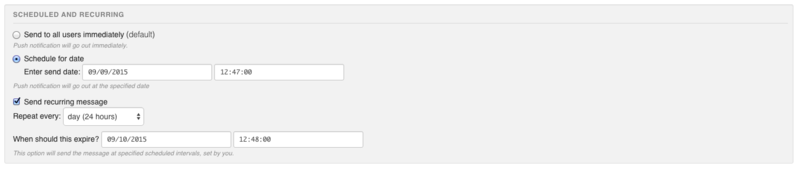

# Sources 
[Project homepage on GIT](https://github.com/QuickBlox/quickblox-android-sdk/tree/master/sample-pushnotifications)

[Download ZIP](https://github.com/QuickBlox/quickblox-android-sdk/archive/master.zip)

<span id="Overview" class="on_page_navigation"></span>
# Overview

## How QuickBlox Push Notifications work
There are 2 ways to integrate Push Notifications into your app:
* **Broadcasting the same message to all users**. It's a simple method which can be used in informational apps that do not 
authenticate users and where same push notification messages are broadcasted to everybody. To send a push you can: 1) simply go to Admin 
panel -> Push Notifications -> type your message in Simple mode -> and hit "Send" for all of 
your users to receive the message; 2) Send a push using Push Notifications API (explained below). Following this way you only need 
to create ONE QuickBlox User which will have all of your users' devices associated with it. Then simply send your pushes to that User.
* **Send individual push alerts**. You can use this when you want to send push notifications to a particular user or a group of 
users (for example notify users that new chat message was sent while they are offline or tell them about some deal/event happening in 
close proximity to their location). Following this way you need to have a QuickBlox User created for each of your app users. Note 
that there are easy ways to transparently create QB Users along with your existing users authentication system or have them sign up 
with Facebook/Twitter/OAuth (described in [Users code sample reference](http://quickblox.com/developers/SimpleSample-users-android)) 
so your end users don't have to type any additional login credentials or know anything about QuickBlox.

Quickblox provides an opportunity to send the notifications(GCM and FCM) the followings ways:
* using admin panel;
* using mobile app;

User can send platform-oriented notification (Android, IOS, WP) or universal notification (all user will receive it, no matter from which 
device they subscribed).

Also, Quickblox provides "Offline push** option" with which push notifications about newly received messages automatically. This works 
from private dialogs and for group dialogs, when user is logged into chat, but haven't joined the group dialog. This option is enabled by 
default, but you can disable it from admin panel anytime.

**Different push types**

Now Google Cloud Messaging can be two types: Google Cloud Messaging (GCM) or Firebase Cloud Messaging (FCM). Our SDK supports both. 
You can set this type in meta-data.

<span id="Preparing_app_for_QuickBlox_Push-notifications" class="on_page_navigation"></span>
To use Quickblox push notifications you need:

1. Add needed settings in admin panel;
2. Integrate QuickBlox Push-notifications module to your application;
3. Настроить приложение для работы с Push-notifications:
* настройка GCM пушей;
* настройка FCM пушей;

<span id="Admin_panel_setup" class="on_page_navigation"></span>
## Admin panel setup
To work with QuickBlox Push-notifications module you need GCM API key. To get it please follow these steps:
* open Firebase developer console;
* choose needed app;
* open Settings/Project Settings
* go to Cloud Messaging
* copy Legacy Server key


You will need to set GCM API key. To do that please navigate to Home -> app_name -> Push notifications -> Settings, 
and access "Google Cloud Messaging (GCM) API key". You can use the **same** api key for **Development** and **Production** environments.


Then you can start use QuickBlox Push Notification API.

<span id="Integration_QuickBlox_Push-notifications_module_in_application" class="on_page_navigation"></span>
## Integration QuickBlox Push-notifications module to application
The instruction below implies that you are aware of Quickblox integration process and have 
already performed the following:

* [Created QuickBlox account](http://admin.quickblox.com/register)
* [Registerer an application in Dashboard](http://quickblox.com/developers/5_Mins_Guide)
* [Integrated QuickBlox SDK into application - stub link]()


To use Push notifications module in your app, you just need to add dependency to **build.gradle** project file:
```groovy
dependencies {
    compile 'com.quickblox:quickblox-android-sdk-messages:3.3.3'
}
```

<span id="Configuring_app_for_work_with_Push-notifications_module_of_QuickBlox_Android_SDK" class="on_page_navigation"></span>
## Application setup to work with Push-notifications module of QuickBlox Android SDK
You do not need to worry about getting GCM or FCM token, tracking subscription's status etc. since all this processes are managed 
inside Quickblox Android SDK. To subscribe the app for push notifications you can just follow the steps below.

### Dependencies setup in ```build.gradle```

As part of enabling Google APIs or Firebase services in your Android application you will need to add the google-services 
plugin to your Project build.gradle file:
```groovy
dependencies {
    classpath 'com.google.gms:google-services:3.0.0'
…
}
```
<div class="attention">
Note: If you use google play services in your project, use version 9.8.0 or higher (version we use in our SDK) as  
all com.google.android.gms libraries must use the exact <b>same version</b> specification.
</div>

<div class="attention">
If you use version <b>higher</b> 10.2.1 just add explicit dependency:
<code>
<br>
compile "com.google.android.gms:play-services-gcm:10.2.6"
<br>
compile "com.google.firebase:firebase-messaging:10.2.6"
<br>
compile "com.google.firebase:firebase-core:10.2.6"
</code>
</div>


Include gms plugin in the **bottom** of your module ```build.gradle```: 
```groovy
apply plugin: 'com.google.gms.google-services'
```

### Setup of ```google-services.json``` file
To be able to work with push notifications you will need to download google-services.json file for your application form firebase 
developer's console. If you choose **GCM** push type you will need to add empty **current_key** settings into your **google-services.json** 
file for your package name (if you do not have such field):
```json
"client": [
    {
      "client_info": {
        "mobilesdk_app_id": "1:761750217637:android:c4299bc46191b0d7",
        "client_id": "android:com.your.app",
        "client_type": 1,
        "android_client_info": {
          "package_name": "com.your.app"
        }
      },
      ...
      "api_key": [
        {
          "current_key": ""
        }
      ],
```

### Setup android manifest
To integrate Auto push subscription you just need set values in ```AndroidManifest.xml```:
```xml
<meta-data android:name="com.quickblox.messages.TYPE" android:value="GCM" />
<meta-data android:name="com.quickblox.messages.SENDER_ID" android:value="@string/sender_id" />
<meta-data android:name="com.quickblox.messages.QB_ENVIRONMENT" android:value="DEVELOPMENT" />
```
```
com.quickblox.messages.TYPE - can be GCM or FCM
com.quickblox.messages.SENDER_ID - your project id from google console (for ex. 761750217637)
com.quickblox.messages.QB_ENVIRONMENT - can be DEVELOPMENT or PRODUCTION
```

and as usual, setting for GCM GcmPushListenerService:
```xml
<service
    android:name="com.quickblox.messages.services.gcm.QBGcmPushListenerService"
    android:exported="false">
    <intent-filter>
        <action android:name="com.google.android.c2dm.intent.RECEIVE" />
    </intent-filter>
</service>

<service
    android:name="com.quickblox.messages.services.gcm.QBGcmPushInstanceIDService"
    android:exported="false">
    <intent-filter>
        <action android:name="com.google.android.gms.iid.InstanceID" />
    </intent-filter>
</service>
```
and other stuff like permissions (look here for details https://developers.google.com/cloud-messaging/android/client).

If you use **FCM** type, it would be a little bit easier to get message, you just need set ```QBFcmPushListenerService``` and 
```QBFcmPushInstanceIDService```:
```xml
<service
    android:name="com.quickblox.messages.services.fcm.QBFcmPushListenerService">
    <intent-filter>
        <action android:name="com.google.firebase.MESSAGING_EVENT" />
    </intent-filter>
</service>

<service 
    android:name="com.quickblox.messages.services.fcm.QBFcmPushInstanceIDService">
    <intent-filter>
        <action android:name="com.google.firebase.INSTANCE_ID_EVENT"/>
    </intent-filter>
</service>
```

**Pay attention, FCM can send 2 types of messages:**
* Notification messages,
* Data messages.

Android app uses different approach to handle each type. Refer to https://firebase.google.com/docs/cloud-messaging/concept-options#notifications_and_data_messages

<span id="Receiving_simple_push_notifications" class="on_page_navigation"></span>
## Receiving simple push notifications
To receive push notification just register BroadcastReceiver:
```java
private BroadcastReceiver pushBroadcastReceiver = new BroadcastReceiver() {
    @Override
    public void onReceive(Context context, Intent intent) {
        String message = intent.getStringExtra("message");
        String from = intent.getStringExtra("from");
        Log.i(TAG, "Receiving message: " + message + ", from " + from);
    }
};


LocalBroadcastManager.getInstance(this).registerReceiver(pushBroadcastReceiver, new IntentFilter("new-push-event"));
```
And that’s all! You are ready to receive push notifications.

<span id="Receiving_push_notifications_with_additional_parameters" class="on_page_navigation"></span>
## Receiving push notifications with additional parameters
Along with ```message``` and ```from``` parameters it is possible to add custom ones to your push notification. You will need:
* GCM push notifications: 

Extend class ```QBGcmPushListenerService``` and override the method ```onMessageReceived(String from, Bundle data)```. 
The parameter ```data``` will contain all additional parameters of your push notification. In the example below you can see, how to get additional data from **GCM** push:
```java
public class GcmPushListenerService extends QBGcmPushListenerService {
    ...
    
    @Override
    public void onMessageReceived(String from, Bundle data) {
        super.onMessageReceived(from, data);

        String message = data.getString("message");
        String customParameter1 = data.getString("custom_parameter_1");
        String customParameter2 = data.getString("custom_parameter_2");
        ...
    }
}
```

<div class="attention">
Будьте внимательны! Если вы используете свой сервис для прослушивания GCM пушей, то в шаге [линка на пункт]() вам необходимо вместо класса
<code>QBGcmPushListenerService</code> засетить свой сервис:
<code>
<br>
вместо нашего сервиса <br>
android:name="com.quickblox.messages.services.gcm.QBGcmPushListenerService"<br>

надо использовать свой сервис <br>
android:name="com.quickblox.my_app.services.GcmPushListenerService"
</code>
</div>

* FCM push notifications: 

Extend class ```QBFcmPushListenerService``` and override the method ```onMessageReceived(RemoteMessage remoteMessage)```. 
The parameter ```remoteMessage``` will contain all additional parameters of your push notification. In the example below you can see, how to get 
additional data from **FCM** push:
```java
public class FcmPushListenerService extends QBFcmPushListenerService {
    ..
    @Override
    public void onMessageReceived(RemoteMessage remoteMessage) {
        super.onMessageReceived(remoteMessage);
        
        Map<String, String> pushData = remoteMessage.getData();
        String message = pushData.get("message");
        String customParameter1 = pushData.get("custom_parameter_1");
        String customParameter2 = pushData.get("custom_parameter_2");
        ...
    }
}
```

<div class="attention">
Pay attention! If you use custom service to listen <b>FCM</> pushes, on the step [thre will be link] you will need to set your service instead 
of <code>QBFcmPushListenerService</code>
<code>
<br>
вместо нашего сервиса <br>
android:name="com.quickblox.messages.services.fcm.QBFcmPushListenerService"<br>

надо использовать свой сервис <br>
android:name="com.quickblox.my_app.services.FcmPushListenerService"
</code>
</div>


<span id="How_to_manage_push_subscriptions" class="on_page_navigation"></span>
## How to manage push subscriptions


### Enable and disable delivering push to application
SDK has some settings for push notification.
You can use global settings to enable or disable delivering pushes via ```QBSettings``` (just set this parameter once):
```java
QBSettings.getInstance().setEnablePushNotification(false); //true by default
```
To check this parameter 
```java
QBSettings.getInstance().isEnablePushNotification();
```

### Tracking subscriptions status
To check whether you have subscribed successfully or not, there is ```QBSubscribeListener```.
Add ```QBSubscribeListener``` right after ```QBSettings.getInstance().init();```
The code snippet is below:
```java
QBPushManager.getInstance().addListener(new QBPushManager.QBSubscribeListener() {
            @Override
            public void onSubscriptionCreated() {
                Log.d(TAG, "onSubscriptionCreated");
            }

            @Override
            public void onSubscriptionError(final Exception e, int resultCode) {
                Log.d(TAG, "onSubscriptionError" + e);
                if (resultCode >= 0) {
                    Log.d(TAG, "Google play service exception" + resultCode);
                }
                Log.d(TAG, "onSubscriptionError " + e.getMessage());
            }
        });
```

### Disabling push subscriptions functionality
If you don’t want to use auto subscribe feature at all, just do not set ```meta-data```.

In case you were subscribed, and now you wish to unsubscribe and do not subscribe again use global setting ```SubscribePushStrategy.NEVER``` 
like this:
```java
// default SubscribePushStrategy.ALWAYS
QBSettings.getInstance().setSubscribePushStrategy(SubscribePushStrategy.NEVER); 
```

And of cause you can subscribe or unsubscribe from pushes whatever you need just use:
И конечно же вы можете самостоятельно подписаться на пуши или отписаться, для этого просто используйте код ниже:
```java
SubscribeService.subscribeToPushes(context, false); //чтобы подписаться на пуши
SubscribeService.unSubscribeFromPushes(context); //чтобы отписаться от пушей

//second param should be true - if you use InstanceIDListenerService and google token onTokenRefresh
@Override
public void onTokenRefresh() {
    SubscribeService.subscribeToPushes(context, true);
}
```

<span id="Migration_to_FCM" class="on_page_navigation"></span>
## Migration to FCM
Firebase Cloud Messaging (FCM) is the new version of GCM. It inherits the reliable and scalable GCM infrastructure, plus new features! 
See the [FAQ](http://firebase.google.com/support/known-issues/#gcm-fcm) to learn more. If you are integrating messaging in a new app, start 
with FCM. GCM users are strongly recommended to upgrade to FCM, in order to benefit from new FCM features today and in the future.

Google prepared great guide how to [Migrate a GCM Client App for Android to Firebase Cloud Messaging](https://developers.google.com/cloud-messaging/android/android-migrate-fcm)

**QuickBlox backend does support FCM endpoints** so you need to update **only client-side** code.


## Sending Push Notifications

<span id="Send_Push_Notifications_from_Admin_panel" class="on_page_navigation"></span>
### Send Push Notifications from Admin panel

Just go to Push Notifications module on Admin panel, choose '''Environment''', '''Channel''', type message and press '''Send message''' button:


Your message will be delivered to all your users. You will see


and


<div class="attention">
> Note:You choose by yourself how to show push to user. There is no standard Android mechanism. 
</div>
Also you can set more options through **Advanced** mode like:
Group of users (using tags), that will receive message


Delivery settings



<span id="Send_Push_Notifications_from_Application" class="on_page_navigation"></span>
### Send Push Notifications from Application
As it was said before it's possible to send 2 types of push notifications:
* Platform based Push Notifications
* Universal push notifications

Refer to the [Push Notification Formats](http://quickblox.com/developers/Messages#Push_Notification_Formats) document for better 
understanding what happens under the hood. 

<span id="Platform_based_Push_Notifications" class="on_page_navigation"></span>
#### Platform based Push Notifications
Send Platform based push notifications (GCM) (only works for Android). Platform based push notification will be delivered to **specified** platform only - in our case it's Android:

##### Send Push Notification to particular users (through their IDs)
```java
// recipients
StringifyArrayList<Integer> userIds = new StringifyArrayList<Integer>();
userIds.add(53779);
userIds.add(960);

QBEvent event = new QBEvent();
event.setUserIds(userIds);
event.setEnvironment(QBEnvironment.DEVELOPMENT);
event.setNotificationType(QBNotificationType.PUSH);
event.setPushType(QBPushType.GCM);
HashMap<String, String> data = new HashMap<String, String>();
data.put("data.message", "Hello");
data.put("data.type", "welcome message");
event.setMessage(data);

QBPushNotifications.createEvent(event).performAsync( new QBEntityCallback<QBEvent>() {
    @Override
    public void onSuccess(QBEvent qbEvent, Bundle args) {
        // sent
    }

    @Override
    public void onError(QBResponseException errors) {

    }
});
```

##### Send push notification to a group of users (via Tags)
```java
// recipients
StringifyArrayList<String> usersTags = new StringifyArrayList<String>();
usersTags.add("Man");
usersTags.add("Car");

QBEvent event = new QBEvent();
event.setUserTagsAny(usersTags);
event.setEnvironment(QBEnvironment.DEVELOPMENT);
event.setNotificationType(QBNotificationType.PUSH);
event.setPushType(QBPushType.GCM);
HashMap<String, String> data = new HashMap<String, String>();
data.put("data.message", "Hello");
data.put("data.type", "welcome message");
event.setMessage(data);

QBPushNotifications.createEvent(event).performAsync( new QBEntityCallback<QBEvent>() {
    @Override
    public void onSuccess(QBEvent qbEvent, Bundle args) {
        // sent
    }

    @Override
    public void onError(QBResponseException errors) {

    }
});
```

##### Send VOIP Push Notifications (iOS only)
To initiate iOS VoIP push notification use ```event.setPushType(QBPushType.APNS_VOIP);``` in above example.

<span id="Universal_push_notifications" class="on_page_navigation"></span>
#### Universal push notifications
Universal push notifications will be delivered to all possible platforms and devices for specified users.
With universal push notifications there are 2 ways to send it:
* Just send a simple push with text only
* With custom parameters

##### Simple push with text
```java
// recipients
StringifyArrayList<Integer> userIds = new StringifyArrayList<Integer>();
userIds.add(53779);
userIds.add(960);

QBEvent event = new QBEvent();
event.setUserIds(userIds);
event.setEnvironment(QBEnvironment.DEVELOPMENT);
event.setNotificationType(QBNotificationType.PUSH);
event.setMessage("Gonna send Push Notification!");

QBPushNotifications.createEvent(event).performAsync(new QBEntityCallback<QBEvent>() {
    @Override
    public void onSuccess(QBEvent qbEvent, Bundle args) {
        // sent
    }

    @Override
    public void onError(QBResponseException errors) {

    }
});
```

##### With custom parameters
Please refer to [Universal Push Notifications payload format](https://quickblox.com/developers/Messages#Use_custom_parameters) to get 
more details what parameters you can use and also how you can initiate iOS VoIP push notifications 
(you can initiate VoIP push by passing ```ios_voip=1``` parameter).

```java

// recipients
StringifyArrayList<Integer> userIds = new StringifyArrayList<Integer>();
userIds.add(53779);
userIds.add(960);

QBEvent event = new QBEvent();
event.setUserIds(userIds);
event.setEnvironment(QBEnvironment.DEVELOPMENT);
event.setNotificationType(QBNotificationType.PUSH);


JSONObject json = new JSONObject();
try {
    json.put("message", "hello");

    // custom parameters
    json.put("user_id", "234");
    json.put("thread_id", "8343");

} catch (Exception e) {
    e.printStackTrace();
}

event.setMessage(json.toString());

QBPushNotifications.createEvent(event).performAsync(new QBEntityCallback<QBEvent>() {
    @Override
    public void onSuccess(QBEvent qbEvent, Bundle args) {
        // sent
    }

    @Override
    public void onError(QBResponseException errors) {

    }
});
```


