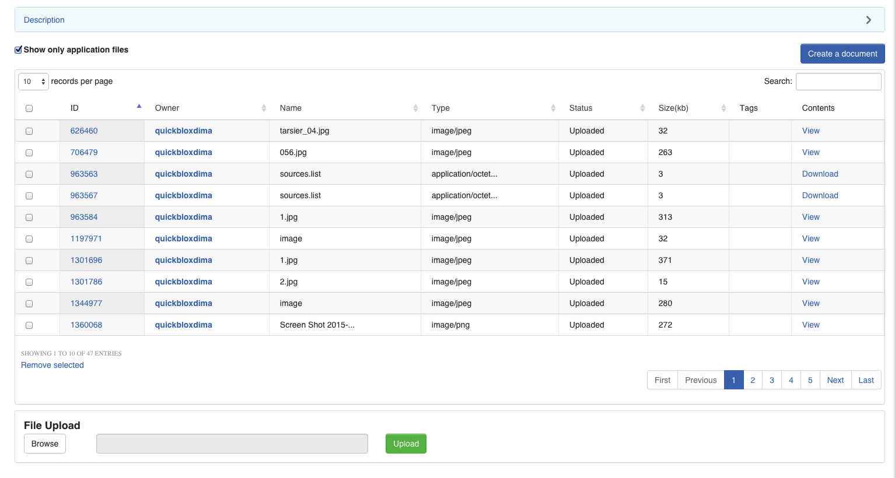

<span id="Overview" class="on_page_navigation"></span>
# Overview
QuickBlox Content API предназначен для загрузки и скачивания файлов любых типов. Этот функционал удобно использовать как вспомогательно 
средство для обмена изображениями, короткими видео- или аудиофайлами (например, видео- или аудио сообщения), либо другими файлами 
(например, документами) во время чатинга.

Максимальный размер файла, который может быть загружен с использованием QuickBlox Content API составляет 100мб.

QuickBlox предоставляет Unlimited Data Storage.


<span id="Manage_content_from_Admin_panel" class="on_page_navigation"></span>
# Управление контентом через админ панель
Content Management System (CMS) allows you to manage the apps contents and settings without having to re-publish it. 
You can upload any files through web interface, edit them, delete - all typical operations.

Go to [Admin panel](http://admin.quickblox.com) -> Content module. You can see list of your files:



You may not have files. To upload new file just use **File Upload** section bellow table - select file to upload using **Choose...**
 button, then press **Upload** button - new file will be uploaded.

You can create rich HTML file using wysiwyg redactor - just press **Add Text/HTML** button - **New file** page will be opened. 
You can use wysiwyg redactor to create rich content.


<span id="Manage_content_from_app" class="on_page_navigation"></span>
# Управление контентом из приложения


<span id="Prepare_your_application_for_QuickBlox_Android_SDK" class="on_page_navigation"></span>
## Prepare your application for Android SDK
Данная инструкция предполагает, что вы уже знакомы с порядком интеграции Quickblox фреймворка в приложение и уже выполнили такие 
действия для своего приложении:

* [Created QuickBlox account](http://admin.quickblox.com/register)
* [Registerer an application in Dashboard](http://quickblox.com/developers/5_Mins_Guide)
* [Integrated QuickBlox SDK into application - stub link]()

## Integrate QuickBlox Content module in your application
To use QuickBlox Content API in your app, you just have to add dependency in **build.gradle** project file:
```groovy
dependencies {
    compile "com.quickblox:quickblox-android-sdk-content:3.3.3"
}
```

Это все, теперь вы можете использовать QuickBlox Content API из вашего приложения.


<span id="Upload_file" class="on_page_navigation"></span>
# Upload file
To upload file using Android SDK use code bellow:

```java
File file = ...;

boolean isPublic = false;

QBContent.uploadFileTask(file, isPublic, null, new QBProgressCallback() {
            @Override
            public void onProgressUpdate(int progress) {
                //progress - прогресс в процентах
            }
        }).performAsync(new QBEntityCallback<QBFile>() {
            @Override
            public void onSuccess(QBFile qbFile, Bundle bundle) {
                //файл успешно загружен
            }

            @Override
            public void onError(QBResponseException e) {
                //произошла ошибка во время загрузки файла
            }
        });
```

Read more about ```isPublic``` argument [here](http://quickblox.com/developers/SimpleSample-content-android#Public.2FPrivate_urls).


<span id="Update_file" class="on_page_navigation"></span>
# Update file
Для обновления уже существующего файла можно воспользоваться примером ниже:
```java
File newFile = ...;

int quickBloxFileID = 91079;

String tags = ...;

QBContent.updateFileTask(newFile, quickBloxFileID, tags, new QBProgressCallback() {
    @Override
    public void onProgressUpdate(int progress) {

    }
}).performAsync( new QBEntityCallback<QBFile>() {
    @Override
    public void onSuccess(QBFile qbFile, Bundle params) {

    }
    
    @Override
    public void onError(QBResponseException errors) {

    }
});
```


<span id="Retrieve_files" class="on_page_navigation"></span>
# Retrieve files

You can use page parameters like:
* ```perPage``` - how many files will contain each page (max 100)
* ```page``` - current returned page

To retrieve list of own files use code bellow:
```java
QBPagedRequestBuilder requestBuilder = new QBPagedRequestBuilder(5, 2);

QBContent.getFiles(requestBuilder).performAsync( new QBEntityCallback<ArrayList<QBFile>>() {
    @Override
    public void onSuccess(ArrayList<QBFile> files, Bundle params) {

    }

    @Override
    public void onError(QBResponseException errors) {

    }
});
```

# Download file

<span id="Download_file_by_UID" class="on_page_navigation"></span>
## Download file by UID

```java
final String fileUID = "6221dd49a1bb46cfb61efe62c4526bd800";
Bundle params = new Bundle();
QBContent.downloadFile(fileUID, new QBProgressCallback() {
    @Override
    public void onProgressUpdate(int progress) {

    }
}, params).performAsync( new QBEntityCallback<InputStream>(){
        @Override
        public void onSuccess(InputStream inputStream, Bundle params) {
            long length = params.getLong(Consts.CONTENT_LENGTH_TAG);
            Log.i(TAG, "content.length: " + length);

            // use inputStream to download a file
        }

        @Override
        public void onError(QBResponseException errors) {

        }
});
```


<span id="Public_Private_urls" class="on_page_navigation"></span>
# Public/Private urls

There are 2 types of files in Content module:

* **Private files** - can be accessed only by QuickBlox user with session token
* **Public files** - can be accessed from anywhere in Internet, don't need to have a session token. 

You can manage this type when you upload a file to Content module via  ```public``` 
[argument](https://quickblox.com/developers/SimpleSample-content-android#Upload_file).

To access a private url use the following method:
```java
QBFile file = ...;
String privateUrl = file.getPrivateUrl();

// or if you have only file UID
String fileUID = "6221dd49a1bb46cfb61efe62c4526bd800";
String privateUrl = file.getPrivateUrlForUID(fileUID);
```


To access a public url use the following method:
```java
QBFile file = ...;
String publicUrl = file.getPublicUrl();

// or if you have only file UID
String fileUID = "6221dd49a1bb46cfb61efe62c4526bd800";
String privateUrl = file.getPublicUrlForUID(fileUID);
```


<span id="Sources" class="on_page_navigation"></span>
# Sources
С примерами использования модуля контент вы можете ознакомиться:
* просмотрев семпл контент [on GIT](https://github.com/QuickBlox/quickblox-android-sdk/tree/master/sample-content)
* загрузив [ZIP со всеми нашими семплами](https://github.com/QuickBlox/quickblox-android-sdk/archive/master.zip)  и выбрав "sample-content".
