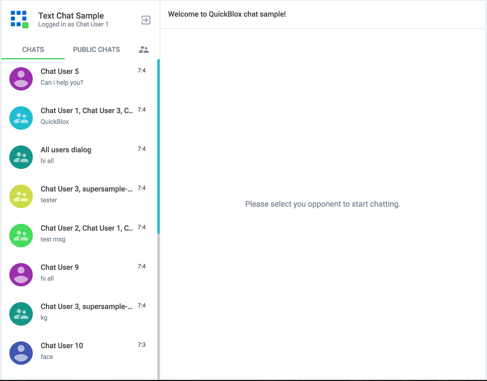

# Sources

Chat saple demo - https://github.com/QuickBlox/quickblox-javascript-sdk/releases/latest

# Overview

This sample shows how to work with QuickBlox Chat API through JavaScript.
It allows to organise your own 1:1 chat or group chat on any website.

# Guide: Getting Started with Chat API

## Get a QuickBlox account

https://quickblox.com/signup/

## Create applications in Admin panel

https://admin.quickblox.com/apps/new

In addition, there is helpful [5 minute guide](https://quickblox.com/developers/5_Minute_Guide).

## Connect QuickBlox to your application

To get the information on how to connect to the QuickBlox library, please, refer to the
[Connect Javascript SDK to Web and Node.js applications](https://quickblox.com/developers/Javascript#Connect_JavaScript_SDK_to_Web_and_Node.js_applications) page.

## Login to Chat

**Note:** In order to login to the chat please read the information about [Chat login/password](https://quickblox.com/developers/Chat#Login_.2F_ID) formation.

In order to use QuickBlox Chat APIs you must:

* Create a session & Sign In to QuickBlox **OR** just create a session with user
* Sign In to QuickBlox Chat

Please follow the lines below:

**Create session with User & Sign In to QuickBlox Chat**

```javascript
var user = {
      id: 4448514,
      name: 'chatuserweb1',
      login: 'chatuserweb1',
      pass: 'chatuserweb1'
    };

QB.createSession({login: user.login, password: user.pass}, function(err, res) {
  if (res) {
    QB.chat.connect({userId: user.id, password: user.pass}, function(err, roster) {
      if (err) {
          console.log(err);
      } else {

       /*
       *  (Object) roster - The user contact list
       *  roster = {
       *    '1126541': {subscription: 'both', ask: null},        // you and user with ID 1126541 subscribed to each other.
       *    '1126542': {subscription: 'none', ask: null},        // you don't have subscription but user maybe has
       *    '1126543': {subscription: 'none', ask: 'subscribe'}, // you haven't had subscription earlier but now you asked for it
       *  };
       */

      }
    });
  }else{
    console.log(err);
  }
});
```

### Custom resource

Is it possible to set custom resource for chat login to identify current computer. For example we use "MacBookPro15", so "MacBookPro15" is our resource:

```javascript
QB.chat.connect({userId: 35, password: 'bestpass', resource: 'MacBookPro15'}, function(err, roster) {
  // callback function
});
```

### Secure connection

By default Chat works over TLS connection.

## Logout from Chat

Next code does chat logout:

```javascript
QB.chat.disconnect();

QB.chat.onDisconnectedListener = onDisconnectedListener;

function onDisconnectedListener(){
  console.log("onDisconnected");
}

```

## Reconnection

By default Javascript SDK reconnects automatically when connection to server is lost.

There are 2 callback to track the state of connection:

```javascriptQB.chat.onDisconnectedListener = onDisconnectedListener;
QB.chat.onReconnectListener = onReconnectListener;

function onDisconnectedListener(){

}

function onReconnectListener(){

}
```

## Dialogs

QuickBlox provides a way to organise a chat dialogs page where you can show all user's current chat dialogs.

Dialogs can have next types:

* 1-1 private dialog - a chat dialog between 2 users
* Group dialog - a chat dialog between many users
* Open group dialog - open chat dialog, any user can join and chat here.

### Retrieve list of dialogs

Here is how typical screen with all your chats looks like (on the left):



Request Dialogs each time user logins to app:

```javascript
var filters = null;

QB.chat.dialog.list(filters, function(err, resDialogs) {
  if (err) {
    console.log(err);
  } else {

  }
});
```

#### Filters

There are some filters to get only chat dialogs you need, not just all.

You can apply filters for the following fields:

* _id (string)
* type (integer)
* name (string)
* last_message_date_sent (integer)
* created_at (date)
* updated_at (date)

You can apply sort for the following fields:

* last_message_date_sent

Filters:

| Operator                                 | Applied fields                                                                                                                                                                                                                                                                                                                                                                                                                                                                                                    | Description                             |
|------------------------------------------|-------------------------------------------------------------------------------------------------------------------------------------------------------------------------------------------------------------------------------------------------------------------------------------------------------------------------------------------------------------------------------------------------------------------------------------------------------------------------------------------------------------------|-----------------------------------------|
| **{field_name}**                         | Search records with field which contains exactly specified value                                                                                                                                                                                                                                                                                                                                                                                                                                                  | {"type": 2};                            |
| **{field_name}** **[{search_operator}]** | Search record with field which contains value according to specified value and operator.Possible filters: **lt** (**L**ess **T**han operator), **lte** (**L**ess **T**han or **E**qual to operator), **gt** (**G**reater **T**han operator), **gte** (**G**reater **T**han or **E**qual to operator), **ne** (**N**ot **E**qual to operator), **in** (Contained **IN** array operator), **nin** **(N**ot contained **IN** array), **all** (**ALL** contained **IN** array), **ctn** (Contains substring operator) | {"type": {"in": [1,2]}}                 |
| **limit**                                | Limit search results to **N** records. Useful for pagination. Default value - 100                                                                                                                                                                                                                                                                                                                                                                                                                                 | {"limit": 50}                           |
| **skip**                                 | Skip **N** records in search results. Useful for pagination. Default (if not specified): 0                                                                                                                                                                                                                                                                                                                                                                                                                        | {"skip": 50}                            |
| **sort_desc/sort_asc**                   | Search results will be sorted by specified field in ascending/descending order                                                                                                                                                                                                                                                                                                                                                                                                                                    | {"sort_desc": "last_message_date_sent"} |

### Get a number of dialogs

There is a separate request to get a number of dialogs:

```javascript
QB.chat.dialog.list({count: 1}, function(err, result) {
  if (err) {
    console.log(err);
  } else {
  }
});
```

To notify all occupants that you created a group chat we use chat notifications - it's simple chat message with extra parameters inside. These parameters used to separate chat notifications from regular text chat messages:

```javascript
notifyOccupants(createdDialog.occupants_ids, createdDialog._id);

function notifyOccupants(dialogOccupants, newDialogId) {
  dialogOccupants.forEach(function(itemOccupanId, i, arr) {
    if (itemOccupanId != currentUser.id) {
      var msg = {
        type: 'chat',
        extension: {
          notification_type: 1,
          _id: newDialogId,
        },
      };

      QB.chat.send(itemOccupanId, msg);
    }
  });
}
```

All opponents will receive this in delegate:

```javascript
QB.chat.onMessageListener = onMessage;

function onMessage(userId, message) {
  // This is a notification about dialog creation
  //
  if (message.extension && message.extension.notification_type === '1') {

  }
}
```

##### Create a Public group chat dialog

It's also possible to create a public group chat, so any user from you application can join it. There is no a list with occupants, this chat is just open for everybody.

To create a public group chat use the same logic as for group chat, but change the gialog's **type** to 1 and don't pass the **occupants_ids** value:

```javascript
var params = {
  type: 1,
  name: "The A team"
};
```

##### Set dialog's avatar

The Chat dialog contains a field **photo**. It's a string field, can contain any value:

* An ID of a file in Content module: [JS example](https://quickblox.com/developers/Sample-content-javascript). This is a way we recommend.
* An ID of a file in Custom Objects module: [JS example](https://quickblox.com/developers/Sample-customobjects-javascript#Files)
* Can be an url to any file in Internet

For example, we use Content module to store the dialog's photo. Next snippets show how to upload a file to Content module and set it as a photo of a dialog:

```javascript
// Upload a file to the Content module
var inputFile = document.querySelector("input[type=file]").files[0];

var params = {name: inputFile.name, file: inputFile, type: inputFile.type, size: inputFile.size, 'public': false};

QB.content.createAndUpload(params, function(err, response){
  if (err) {
    console.log(err);
  } else {
    var uploadedFileId = response.id;
  }
});
```

### Create new 1-1(private) chat dialog

If you would like to create a private chat dialog too - use next snippets:

```javascript
var params = {
  type: 3,
  occupants_ids: [47]
};

QB.chat.dialog.create(params, function(err, createdDialog) {
  if (err) {
    console.log(err);
  } else {
  }
});
```

#### Custom parameters

Dialogs can store additional parameters. These parameters can be used to store an additional data. Also these parameters can be used in dialogs retrieval requests.

To start use additional parameters it needs to create an additional schema of your parameters. This is a [CustomObjects class.](https://quickblox.com/developers/Custom_Objects#Create_data_schema) Just create an empty class with all needed fields. These fields will be your dialog additional parameters.

Next, to set additional parameters to a dialog use next additional parameters in a creation request:

1. **data[class_name]** - should contain CustomObjects class name created above
2. **data[field1]**
3. **data[...]**
4. **data[fieldN]**

When you create a dialog then set a dialog's param **data:**

```javascript
var params = {
  data: {
    class_name: "dialog_data",
    age: 33
  },
  ...
};
```

It's also possible to use custom parameters in a dialogs retrieval requests so dialogs can be filtered through custom parameters:

```javascript
var filters = {
  data: {
    class_name: "dialog_data",
    age: 33
  }
};
```

### Update group dialog

User can update group chat dialog name, add new occupants or leave this group chat. To add more occupants use **push_all** operator. To leave group chat (remove yourself) - use **pull_all** operator:

```javascript
var dialogId = "53aac645535c12bd3b008a40";

var toUpdateParams = {
  name: "My school friends",
  push_all: {occupants_ids: [300,301]},
};

QB.chat.dialog.update(dialogId, toUpdateParams, function(err, res) {
  if (err) {
      console.log(err);
  } else {

  }
});
```

To notify all occupants that you updated a group chat we use chat notifications - it's simple chat message with extra parameters inside. These parameters used to separate chat notifications from regular text chat messages:

```javascript
notifyOccupants(updatedDialog.occupants_ids, updatedDialog._id);

function notifyOccupants(dialogOccupants, dialogId) {
  dialogOccupants.forEach(function(itemOccupanId, i, arr) {
    if (itemOccupanId != currentUser.id) {
      var msg = {
        type: 'chat',
        extension: {
          notification_type: 2,
          _id: dialogId,
        },
      };

      QB.chat.send(itemOccupanId, msg);
    }
  });
}
```

All opponents will receive this in delegate:

```javascript
QB.chat.onMessageListener = onMessage;

function onMessage(userId, message) {
  // This is a notification about dialog update
  //
  if (message.extension && message.extension.notification_type === '2') {

  }
}
```

### Delete dialog

To delete a dialog or dialogs use next snippet:

```javascript
QB.chat.dialog.delete(["55c324c3535c123675001caa"], function(err) {
  if (err) {
    console.log("err: " + err);
  } else {

  }
});
```

This request will remove this dialog for current user, but other users still will be able to chat there.

If you are the creator of a dialog, you can completely remove it from the backend using 'force' parameter:

```javascript
QB.chat.dialog.delete(["55c324c3535c123675001caa"], {force: 1}, function(err) {
  if (err) {
    console.log("err: " + err);
  } else {

  }
});
```

### Chat in dialog

#### Chat in 1-1 private dialog

To send a message in 1-1 chat:

```javascript
var msg = {
  type: 'chat',
  body: "How are you today?",
  extension: {
    save_to_history: 1,
  }
};

var opponentId = 78;
QB.chat.send(opponentId, msg);
// or msg.id = QB.chat.send(opponentId, msg) if message id is needed

...

QB.chat.onMessageListener = onMessage;

function onMessage(userId, msg) {

}
```

#### Chat in group dialog

Before start chating in a group dialog you should join this dialog.

```javascript
var dialogJid = "...";

QB.chat.muc.join(dialogJid, function(resultStanza) {
  var joined = true;

  for (var i = 0; i < resultStanza.childNodes.length; i++) {
    var elItem = resultStanza.childNodes.item(i);
    if (elItem.tagName === 'error'){
      joined = false;
    }
  }
});
```

After join you can send and receive messages:

```javascript
var msg = {
  type: 'groupchat',
  body: "How are you today?",
  extension: {
    save_to_history: 1,
  }
};

var dialogJid = "...";
QB.chat.send(dialogJid, msg);
// or msg.id = QB.chat.send(dialogJid, msg) if message id is needed

...

QB.chat.onMessageListener = onMessage;

function onMessage(userId, msg) {

}

```

##### Get online users

You can request online users in group chat dialog:

```javascript
var dialogJid = "...";

QB.chat.muc.listOnlineUsers(dialogJid, function(users) {

});
```

##### Leave group chat dialog

```javascript
var dialogJid = "...";

QB.chat.muc.leave(dialogJid, function() {
  console.log("Joined dialog " + dialogId);
});
```

### Send and receive a message with attachment
