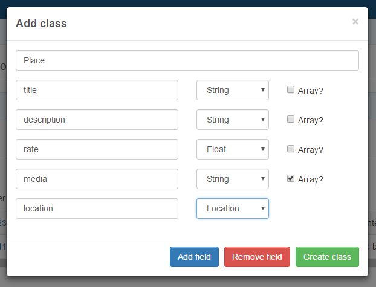

This sample shows you how to work with Users API, **Custom Objects API** and **Content API** by Quickblox JavaScript SDK.
It allows you to create any server side data structure, authorize and work with files as uploading.

Below is the sample you'll create using this tutorial, sources files you can found in [Github](https://github.com/QuickBlox/quickblox-javascript-sdk/tree/gh-pages/samples) or inspect detailed on [Github Pages](https://quickblox.github.io/quickblox-javascript-sdk/samples/data).

<!--- TODO: change to src DATA to github --->
<iframe width="100%" height="480" src="https://samples.quickblox.com/web/data" frameborder="0" allowfullscreen></iframe>

# Try it yourself
Before all, adding a Custom Data structure to your application.

<div class="panel panel-warning">
  <div class="panel-body">
     Note: This guide based on <a href="https://quickblox.com/developers/Custom_Objects" target="_blank">Custom Objects REST API documentation</a>. It is very helpful, describes the full list of QuickBlox Custom Objects API features and need to be read in addition to reading this guide.
  </div>
</div>

To start using the Custom Objects module you should create your data scheme. Go to [admin.quickblox.com](https://admin.quickblox.com/), find the Custom Objects module page and press the Add new class button. The 'add new class' popup will then appear.



Enter Class name, add fields any you want. Allow 7 types of fields:
* Integer;
* Float;
* Boolean;
* String;
* File;
* Location;
* Array (of Integers, Floats, Booleans, Strings);

<div class="panel panel-info">
  <div class="panel-body">
    Important:
    There are some predefined fields, that are described in this <a href="http://quickblox.com/developers/Custom_Objects#Module_description" target="_blank">Custom Objects REST API Module description</a> documentation.
  </div>
</div>

### Create a record
There are 2 ways to create a record:
* through the Admin panel
* using the Javascript SDK

#### Create record through Admin panel

Just go to [admin.quickblox.com](https://admin.quickblox.com/), find the Custom Objects module page and press the **Add record** button. The **add new record** popup will then appear. Fill in any fields you want and press the Add record button again. The new record will then be added & shown in the table.

#### Create record using Javascript SDK

In order to create records you must be logged in and to act on a user's behalf - please refer to Javascript Users API documentation.

To create a record just use the code below:

```javascript
var className = 'Place';
var recorded = {
  title: 'Example Title',
  description: 'Some example description'
};

QB.data.create(className, recorded, function(err, res){
    if (err) {
        console.log(err);
    } else {
        console.log(res);
    }
});
```

### Retrieve records
To retrieve a record use next method:
```javascript
var className = 'Place';
var filter = { sort_asc: 'created_at' };
 
QB.data.list(className, filter, function(err, result){
    if (err) { 
        console.log(err);
    } else {
        console.log(result);
    }
});
```

### Filters
The request can contain all, some or none of next filters.


| Filter | Applicable to types | Usage example | Description |
|--------|---------------------|---------------|-------------|
| {field_name} | All types | {rating: '2'} | Search records with field which contains exactly specified value |
|{field_name} [{search_operator}] |All types | {rating: {gt: '2'}} | Search record with field which contains value according to specified value and operator |
|***sort_asc*** | All types  | {sort_asc: 'created_at'} | Search results will be sorted by specified field in ascending order |
|***sort_desc*** | All types  | {sort_desc: 'created_at'} | Search results will be sorted by specified field in descending order |
|***skip*** | Integer | {skip: '100'} | Skip N records in search results. Useful for pagination. Default (if not specified): 0 |
|***limit*** | Integer | {limit: '100'} | Limit search results to N records. Useful for pagination. Default value - 100. Also can set 1000.***If limit is equal to -1 only last record will be returned*** |
|***count*** | Integer | {count: '1'} | Count search results. Response will contain only count of records found |
|**output[include]** | All types | {output: {include: 'name,rating'}} | The **output** parameter takes the form of a record with a list of fields for inclusion or exclusion from the result set. **output[include]** specifies the fields to include. The **_id** field is, by default, included in the result set. To exclude the **_id** field from the result set, you need to specify in the **output[exclude]** value the exclusion of the _id field. |
|**output[exclude]** | All types | {output: {exclude: 'name,rating'}} | The **output** parameter takes the form of a record with a list of fields for inclusion or exclusion from the result set. **output[exclude]** specifies the fields to exclude. The **_id** field is, by default, included in the result set. To exclude the **_id** field from the result set, you need to specify in the **output[exclude]** value the exclusion of the **_id** field. |
|**near** | Location | {user_location: {near: '23.4545,56.1233;10'}} |  Search records in a specific radius with current position in meters. Value format: longitude,latitude;radius (in meters) |

### Search operators
The request can contain all, some or none of next search operators. Combinations of operators are allowed.

| Operator | Applicable to types | Usage example | Description |
|----------|---------------------|---------------|-------------|
| **lt** | Integer, Float | {rating: {lt: '2'}}| **L**ess **T**han operator |
| **lte**| Integer, Float | {rating: {lte: '2'}} | **L**ess **T**han or **E**qual to operator|
| **gt** | Integer, Float | {rating: {gt: '2'}} | **G**reater **T**han operator |
| **gte** | Integer, Float | {rating: {gte: '2'}}| **G**reater **T**han or **E**qual to operator |
| **ne** | Integer, Float, String, Boolean | {rating: {ne: '2'}} | **N**ot **E**qual to operator |
| **in** | Integer, Float, String | {tags: {in: 'man,golf'}} | Contained **IN** array operator |
| **nin** | Integer, Float, String | {tags: {nin: 'man,golf'}} | **N**ot contained **IN** array |
| **all** | Array | {tags: {all: 'man,golf'}} | **ALL** contained **IN** array |
| **or** | Integer, Float, String | 1.{name: {or: 'igor,bob'}}<br>2.{name: {or: 'igor'}, lastname: {or: 'khomenko'}} | 1.Will return records with name **igor** or **bob** <br>2.Will return records with name **igor** or lastname **khomenko** |
| **ctn** | String | {name: {ctn: 'ar'}} | Will return all records where **username** field contains **ar** substring |

For example, if we want to retrieve 5 movies that:
 * Have a rating > 5.5
 * Are not documentaries.
 * Must be sorted by the rating field in ascending order.

```javascript
var className = "Movie";
var filter = {rating: {gt: '5.5'}, limit: '5', documentary: 0, sort_asc: 'rating'};
 
QB.data.list(className, filter, function(err, result){
    if (err) { 
        console.log(err);
    } else {
        console.log(result);
    }
});
```

### Update record
To update an existing record you should know the record's ID. Let's update Movie with ID of 502f7c4036c9ae2163000002 - and set rating to 7.88:

```javascript
var className = "Movie";
var param = {_id: '502f7c4036c9ae2163000002', rating: '7.88'}
 
QB.data.update(className, param, function(err, res){
    if (err) {
        console.log(err);
    } else {
        console.log(res);
    }
});
```

Also there are Special update operators, that are very helpful for some purpose, e.g. update Array field etc:

#### Special update operators

| Operator | Applicable to types | Usage example | Description |
|----------|---------------------|---------------|-------------|
| inc | Integer, Float | {inc: {rating: 1}} | Increment field to specified value. Value can positive or negative (i.e. decrement operation) |
| pull | Arrays | {pull: {tags: 'man'}} | Removes specified value from array field |
| pull **with filter** | Arrays | {pull: {user_ids: {gt: '10'}}} | Removes all elements, which filtered by filter operator, from array |
| pull_all | Arrays | {pull_all: {user_ids: [11, 10]}}} | Removes all specified values from array |
| pop | Arrays | {pop: {tags: 1}} | Removes last element from array. To remove first element value should be equal **-1** |
| push | Arrays | {push: {tags: 'one'}} | Appends specified values to array |
| add_to_set | Arrays | {add_to_set: {tags: 'man'}} | Adds a value to an array only if the value is not in the array already |
| Update array element by index operator | Arrays | {tags: {1: 'two'}} | Update array element by index |

Let's update an element with index 1 in array 'tags' with value 'man':

```javascript
var className = "Movie";
var param = {_id: '502f7c4036c9ae2163000002', tags: {1: 'man'}}
 
QB.data.update(className, param, function(err, res){
    if (err) {
        console.log(err);
    } else {
        console.log(res);
    }
});
```

### Delete records

```javascript
var className = "Movie";
var _id = "502f7c4036c9ae2163000002";
 
QB.data.delete(className, _id, function(err, res){
    if (err) {
        console.log(err);
    } else {
        console.log(res);
    }
});
```

### Aggregation operators
Use [REST API Aggregation operators](http://quickblox.com/developers/Custom_Objects#Aggregation_operators) as a basis to perform aggregation requests.

The following method is used to perform aggregation operations:
```javascript
var className = "Movie";
var filter = {rating: {calc 'sum'}, group_by: 'user_id'};
 
QB.data.list(className, filter, function(err, result){
    if (err) { 
        console.log(err);
    } else {
        console.log(result);
    }
});
```

### Relations
We can allow relations between 2 objects to be organized - just use the special field **_parent_id**.

For example, if you want to add Comments to a movie - you can use this code snippet below:

```javascript
var className = "Comment";
var params = {text: "The first film in the series was originally released on May 25, 1977", _parent_id: "50aa4d8fefa357fa14000001"};
 
QB.data.create(className, params, function(err, res){
    if (err) {
        console.log(err);
    } else {
        console.log(res);
    }
});
```

This is a strong reference - it means that if you delete parent record (Movie) - all the child records (Comments) will be deleted too. This field (_parent_id) may be included in Retrieve/Create/Update queries as well.

### Permissions
A Permission (access control list) is a list of permissions attached to a record in the Custom Objects module. This list specifies which users are granted access to records, as well as what operations are allowed on given objects (READ,CREATE,UPDATE,DELETE).

Each entry in a typical Permissions specifies a subject and an operation. For instance, if a record has a permission that contains (Garry, EDIT), this would give Garry permission to edit this record.

Read [Permissions REST API](http://quickblox.com/developers/Custom_Objects#Permissions) description to better understand how it works

There are 4 typical operations on record:
* CREATE
* READ
* UPDATE
* DELETE
* CREATE operations can't be set through API (only in Admin panel)

Each operation has information on who can perform it on object.

There are 5 values:
* open - any user can perform operation on this record
* owner - only owner can perform operation on this record
* not_allowed - nobody can perform operation on this record (except Owner)
* open_for_users_ids - users with these IDs can perform operation on this record
* open_for_groups - users in these groups can perform operation on this record

Note: Owners always have access to their own records (except for any case where Class permissions level is enabled)

### Creating records with Permissions

Let's create a record with the following permissions:
* READ: Open
* UPDATE: Users in groups golf, man
* DELETE: Users with IDs 3060, 63635

```javascript
var className = "Blog";
var permissions = {read: {access: 'open'}, 
                 update: {access: 'open_for_groups', groups: ["golf", "man"]},  
                 delete: {access: 'open_for_users_ids', ids: [5, 67,82]}};  
}
var params = {name: "Star Wars", genre: "fantasy", permissions: permissions};
 
QB.data.create(className, params, function(err, res){
    if (err) {
        console.log(err);
    } else {
        console.log(res);
    }
});
```

It is possible to update permissions in a same way.

### Files
Custom Objects module supports the ‘File’ field type. It is created to easily work with content from Custom Objects module. There is an ability to upload, download, update and delete content of file fields.

The max file size is 32 MB.

#### Upload / Update a file

```javascript
var className = "Blog";
var recordId = "42453312753abce36783882222";
var inputFile = $("input[type=file]")[0].files[0];
var params = {id: recordId, field_name: "user_avatar", file: inputFile};
 
// on node.js you also have to pass the 'name' parameter
// params.name = "wolf.jpg";
 
QB.data.uploadFile(className, params, function(err, res){
    if (err) {
        console.log(err);
    } else {
        console.log(res);
    }
});
```

#### Download a file

Use the following method to make an url to set it for your img element:

```javascript
var className = "Movie";
 
var paramsFor = {
  id: "1734252234523893bae6739922339984a3bb",
  field_name: "poster"
};
 
var fileUrl = QB.data.fileUrl(className, paramsFor);
 
var imageHTML = "";
```

#### Delete a file
```javascript
var className = "Blog";
var recordId = "42453312753abce36783882222";
var params = {id: recordId, field_name: "user_avatar"};
 
QB.data.deleteFile(className, params, function(err, res){
    if (err) {
        console.log(err);
    } else {
        console.log(res);
    }
});
```