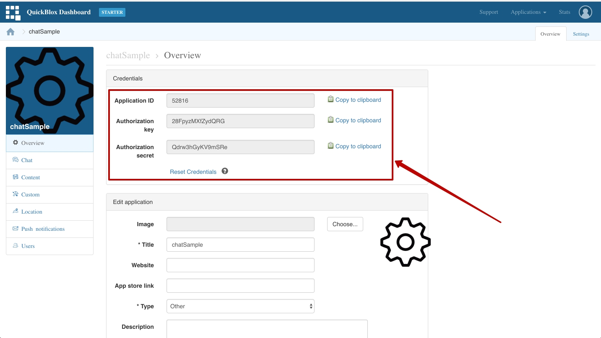
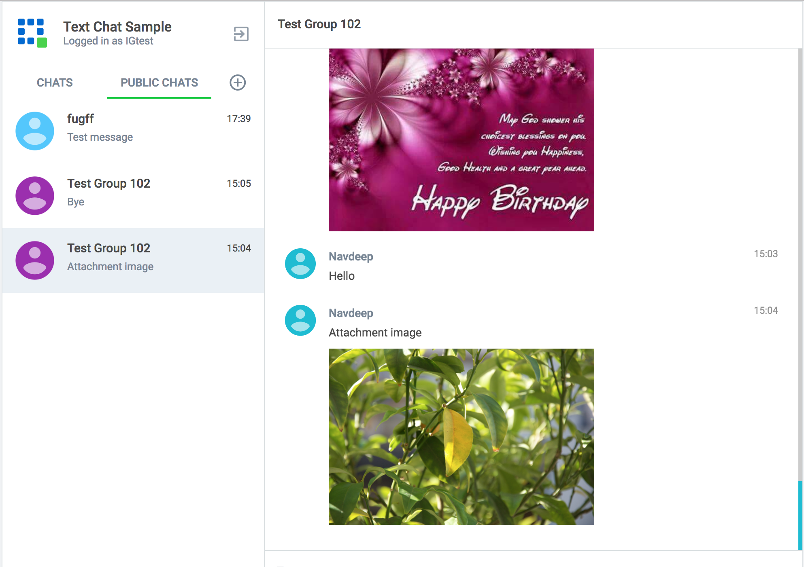

This sample shows how to work with **QuickBlox Chat API** through JavaScript. 
It allows to organise your own 1:1 chat or group chat on any website.

All sourse files you can find in [Github reposytory](https://github.com/QuickBlox/quickblox-javascript-sdk/tree/gh-pages/samples).

<!--- TODO: change to src DATA to github --->
<iframe width="100%" height="480" src="https://samples.quickblox.com/web/newChat" frameborder="0" allowfullscreen></iframe>

# Try it yourself
### Create QB account
Before all, you need to crate a QuickBlox account [here](https://quickblox.com/signup/) and [create aplication](https://admin.quickblox.com/apps/new) in admin panel.

<div class="panel panel-warning">
  <div class="panel-body">
     Note: In addition, there is helpful <a href="https://quickblox.com/developers/5_Minute_Guide" target="_blank">5 minute guide.</a>
  </div>
</div>

### Set your credentials to the configuration file

 Set your Application ID, Authorization key, Authorization secret credentials to the [configuration file](https://github.com/QuickBlox/quickblox-javascript-sdk/blob/gh-pages/samples/newChat/js/QBconfig.js). 

All of this data you can find in your admin panel, by clicking on the application icon.



# Guide: Getting Started with Chat API

### Connect QuickBlox to your application

To get the information on how to connect to the QuickBlox library, please, refer to the [Connect Javascript SDK to Web and Node.js applications](https://quickblox.com/developers/Javascript#Connect_JavaScript_SDK_to_Web_and_Node.js_applications) page.

### Login to the chat

<div class="panel panel-warning">
  <div class="panel-body">
     Note: In order to login to the chat please read the information about <a href="https://quickblox.com/developers/Chat#Login_.2F_ID" target="_blank">Chat login/password</a> formation.
  </div>
</div>

In order to use QuickBlox Chat APIs you must:

* Create a session & Sign In to QuickBlox **OR** just create a session with user
* Sign In to QuickBlox Chat

Please follow the lines below:

**Create session with User & Sign In to QuickBlox Chat**
```javascript
var user = {
      id: 4448514,
      name: 'chatuserweb1',
      login: 'chatuserweb1',
      pass: 'chatuserweb1'
    };
 
QB.createSession({login: user.login, password: user.pass}, function(err, res) {
  if (res) {
    QB.chat.connect({userId: user.id, password: user.pass}, function(err, roster) {
      if (err) {
          console.log(err);
      } else {
 
       /*
       *  (Object) roster - The user contact list
       *  roster = {
       *    '1126541': {subscription: 'both', ask: null},        // you and user with ID 1126541 subscribed to each other.
       *    '1126542': {subscription: 'none', ask: null},        // you don't have subscription but user maybe has
       *    '1126543': {subscription: 'none', ask: 'subscribe'}, // you haven't had subscription earlier but now you asked for it
       *  }; 
       */
 
      }
    });
  }else{
    console.log(err);
  }
});
```

### Custom resource

Is it possible to set custom resource for chat login to identify current computer. For example we use "MacBookPro15", so "MacBookPro15" is our resource:

```javascript
QB.chat.connect({userId: 35, password: 'bestpass', resource: 'MacBookPro15'}, function(err, roster) {
  // callback function
});
```

### Secure connection

By default Chat works over TLS connection.

### Logout from the Chat

Next code does chat logout:

```javascript
QB.chat.disconnect();
 
...
 
QB.chat.onDisconnectedListener = onDisconnectedListener;
 
function onDisconnectedListener(){
  console.log("onDisconnected");
}
```

### Reconnection

By default Javascript SDK reconnects automatically when connection to server is lost.

There are 2 callback to track the state of connection:

```javascript
QB.chat.onDisconnectedListener = onDisconnectedListener;
QB.chat.onReconnectListener = onReconnectListener;
 
function onDisconnectedListener(){
// your code 
}
 
function onReconnectListener(){
// your code
}
```

## Dialogs

QuickBlox provides a way to organise a chat dialogs page where you can show all user's current chat dialogs.

Dialogs can have next types:

* 1-1 private dialog - a chat dialog between 2 users
* Group dialog - a chat dialog between many users
* Open group dialog - open chat dialog, any user can join and chat here.

### Retrieve list of dialogs

Here is how typical screen with all your chats looks like (on the left):


Request Dialogs each time user logins to app:

```javascript
var filters = null;
 
QB.chat.dialog.list(filters, function(err, resDialogs) {
  if (err) {
    console.log(err);
  } else {
 
  }
});
```

#### Filters

There are some filters to get only chat dialogs you need, not just all.

You can apply filters for the following fields:
* _id (string)
* type (integer)
* name (string)
* last_message_date_sent (integer)
* created_at (date)
* updated_at (date)

You can apply sort for the following fields:
* last_message_date_sent

Filters:
| Operator | Applied fields  | TypeDescription |
|--|-|--|
| **{field_name}** | Search records with field which contains exactly specified value | {"type": 2};  |
| **{field_name}[{search_operator}]** | Search record with field which contains value according to specified value and operator.Possible filters: **lt** (**L**ess **T**han operator), **lte** (**L**ess **T**han or **E**qual to operator), **gt** (**G**reater **T**han **o**perator), **gte** (**G**reater **T**han or **E**qual to operator), **ne** (**N**ot **E**qual to operator), **in** (Contained **IN** array operator), **nin** (**N**ot contained **IN** array), **all** (**ALL** contained **IN** array), **ctn** (Contains substring operator) | {"type": {"in": [1,2]}}  |
| **limit**  | Limit search results to **N** records. Useful for pagination. Default value - 100 | {"limit": 50} |
| **skip**   | Skip **N** records in search results. Useful for pagination. Default (if not specified): 0  | {"skip": 50} |
| **sort_desc/sort_asc**  | Search results will be sorted by specified field in ascending/descending order | {"sort_desc": "last_message_date_sent"} |

### Get a number of dialogs

There is a separate request to get a number of dialogs:

``` javascript
QB.chat.dialog.list({count: 1}, function(err, result) {
  if (err) {
    console.log(err);
  } else {
  }
});
```

### Create new dialog

According to [REST API, Create a dialog query](https://quickblox.com/developers/Chat#Create_dialog), you don't need to create a dialog for 1-1(private) chat - it will be created automatically with 1st chat message. But you can create it anyway if you need this for your application.

#### Create new group chat dialog

When user would like to start a group chat - he should create a group chat dialog first.

User should choose other users to add them to a new group dialog. Also he must choose a name for new group chat:

``` javascript
var params = {
  type: 2,
  occupants_ids: [45,78],
  name: "The A team"
};
 
QB.chat.dialog.create(params, function(err, createdDialog) {
  if (err) {
    console.log(err);
  } else {
  }
});
```

To notify all occupants that you created a group chat we use chat notifications - it's simple chat message with extra parameters inside. These parameters used to separate chat notifications from regular text chat messages:

``` javascript
notifyOccupants(createdDialog.occupants_ids, createdDialog._id);
 
function notifyOccupants(dialogOccupants, newDialogId) {
  dialogOccupants.forEach(function(itemOccupanId, i, arr) {
    if (itemOccupanId != currentUser.id) {
      var msg = {
        type: 'chat',
        extension: {
          notification_type: 1,
          _id: newDialogId,
        }, 
      };
 
      QB.chat.send(itemOccupanId, msg);
    }
  });
}
```

All opponents will receive this in delegate:

``` javascript
QB.chat.onMessageListener = onMessage;
 
function onMessage(userId, message) {
  // This is a notification about dialog creation
  //
  if (message.extension && message.extension.notification_type === '1') {
 
  }
}
```

##### It's also possible to create a public group chat, so any user from you application can join it. There is no a list with occupants, this chat is just open for everybody.

To create a public group chat use the same logic as for group chat, but change the gialog's **type** to 1 and don't pass the **occupants_ids** value:

```javascript
var params = {
  type: 1,
  name: "The A team"
};
```

##### Set dialog's avatar

The Chat dialog contains a field **photo**. It's a string field, can contain any value:
* An ID of a file in Content module: [JS example](https://quickblox.com/developers/Sample-content-javascript). This is a way we recommend.
* An ID of a file in Custom Objects module: [JS example](https://quickblox.com/developers/Sample-customobjects-javascript#Files).
* Can be an url to any file in Internet.

For example, we use Content module to store the dialog's photo. Next snippets show how to upload a file to Content module and set it as a photo of a dialog:

```javascript
// Upload a file to the Content module
var inputFile = $("input[type=file]")[0].files[0];
 
var params = {name: inputFile.name, file: inputFile, type: inputFile.type, size: inputFile.size, 'public': false};
QB.content.createAndUpload(params, function(err, response){
  if (err) {
    console.log(err);
  } else {
    var uploadedFileId = response.id;
  }
});
```

#### Create new 1-1(private) chat dialog

If you would like to create a private chat dialog too - use next snippets:

```javascript
var params = {
  type: 3,
  occupants_ids: [47]
};
 
QB.chat.dialog.create(params, function(err, createdDialog) {
  if (err) {
    console.log(err);
  } else {
  }
});
```

### Custom parameters

Dialogs can store additional parameters. These parameters can be used to store an additional data. Also these parameters can be used in dialogs retrieval requests.

To start use additional parameters it needs to create an additional schema of your parameters. This is a [CustomObjects class](https://quickblox.com/developers/Custom_Objects#Create_data_schema). Just create an empty class with all needed fields. These fields will be your dialog additional parameters.

Next, to set additional parameters to a dialog use next additional parameters in a creation request:
1. **data[class_name]** - should contain CustomObjects class name created above
2. **data[field1]**
3. **data[...]**
4. **data[fieldN]**

When you create a dialog then set a dialog's param **data:**

```javascript
var params = {
  data: {
    class_name: "dialog_data",
    age: 33
  },
  ...
};
```

It's also possible to use custom parameters in a dialogs retrieval requests so dialogs can be filtered through custom parameters:

```javascript
var filters = {
  data: {
    class_name: "dialog_data",
    age: 33
  }
};
```

### Update group dialog

User can update group chat dialog name, add new occupants or leave this group chat. To add more occupants use **push_all** operator. To leave group chat (remove yourself) - use **pull_all** operator:

```javascript
var dialogId = "53aac645535c12bd3b008a40";
 
var toUpdateParams = {
  name: "My school friends",
  push_all: {occupants_ids: [300,301]},
};
 
QB.chat.dialog.update(dialogId, toUpdateParams, function(err, res) {
  if (err) {
      console.log(err);
  } else {
 
  }
});
```

To notify all occupants that you updated a group chat we use chat notifications - it's simple chat message with extra parameters inside. These parameters used to separate chat notifications from regular text chat messages:

```javascript
notifyOccupants(updatedDialog.occupants_ids, updatedDialog._id);
 
function notifyOccupants(dialogOccupants, dialogId) {
  dialogOccupants.forEach(function(itemOccupanId, i, arr) {
    if (itemOccupanId != currentUser.id) {
      var msg = {
        type: 'chat',
        extension: {
          notification_type: 2,
          _id: dialogId,
        }, 
      };
 
      QB.chat.send(itemOccupanId, msg);
    }
  });
}
```

All opponents will receive this in delegate:

```javascript
QB.chat.onMessageListener = onMessage;
 
function onMessage(userId, message) {
  // This is a notification about dialog update
  //
  if (message.extension && message.extension.notification_type === '2') {
 
  }
}
```

### Delete dialog

To delete a dialog or dialogs use next snippet:

```javascript
QB.chat.dialog.delete(["55c324c3535c123675001caa"], function(err) {
  if (err) {
    console.log("err: " + err);
  } else {
 
  }
});
```

This request will remove this dialog for current user, but other users still will be able to chat there.

If you are the creator of a dialog, you can completely remove it from the backend using 'force' parameter:

```javascript
QB.chat.dialog.delete(["55c324c3535c123675001caa"], {force: 1}, function(err) {
  if (err) {
    console.log("err: " + err);
  } else {
 
  }
});
```

### Chat in dialog

#### Chat in 1-1 private dialog

To send a message in 1-1 chat:

```javascript
var msg = {
  type: 'chat',
  body: "How are you today?",
  extension: {
    save_to_history: 1,
  }
};
 
var opponentId = 78;
QB.chat.send(opponentId, msg);
// or msg.id = QB.chat.send(opponentId, msg) if message id is needed
 
...
 
QB.chat.onMessageListener = onMessage;
 
function onMessage(userId, msg) {
 
}
```
#### Chat in group dialog

Before start chating in a group dialog you should join this dialog.

```javascript
var dialogJid = "...";
 
QB.chat.muc.join(dialogJid, function(resultStanza) {
  var joined = true;
 
  for (var i = 0; i < resultStanza.childNodes.length; i++) {
    var elItem = resultStanza.childNodes.item(i);
    if (elItem.tagName === 'error'){
      joined = false; 
    }
  }
});
```

After join you can send and receive messages:

```javascript
var msg = {
  type: 'groupchat',
  body: "How are you today?",
  extension: {
    save_to_history: 1,
  }
};
 
var dialogJid = "...";
QB.chat.send(dialogJid, msg);
// or msg.id = QB.chat.send(dialogJid, msg) if message id is needed
 
...
 
QB.chat.onMessageListener = onMessage;
 
function onMessage(userId, msg) {
 
}
```
##### Get online users

You can request online users in group chat dialog:

```javascript
var dialogJid = "...";
 
QB.chat.muc.listOnlineUsers(dialogJid, function(users) {
 
});
```

##### Leave group chat dialog

```javascript
var dialogJid = "...";
 
QB.chat.muc.leave(dialogJid, function() {
  console.log("Joined dialog " + dialogId);
});
```

### Send and receive a message with attachment

### Send attachment

It's possible to add attachments to message: for example, image, audio file or video file. We don't have any restrictions here - you can attach any type of file.

To send a message with attachments you should use the same way as you send regular message with text, but add to it an attachment object. Attachment can be:

* An ID of a file in Content module: [JS example](https://quickblox.com/developers/Sample-content-javascript). This is a way we recommend.
* An ID of a file in Custom Objects module: [JS example](https://quickblox.com/developers/Sample-customobjects-javascript#Files)
* Can be an url to any file in Internet

To send a message with attachment you should upload a file to Content module, Custom Objects module using sample above or use an url to any file in Internet. Then you should incorporate an ID to file to message.

For example, we use Content module to store attachments. Next snippets show how to upload a file to Content module and send it as an attach:

```javascript
// Upload a file to the Content module
var inputFile = $("input[type=file]")[0].files[0];
 
var params = {name: inputFile.name, file: inputFile, type: inputFile.type, size: inputFile.size, 'public': false};
QB.content.createAndUpload(params, function(err, response){
  if (err) {
    console.log(err);
  } else {
    var uploadedFileId = response.id;
 
    // prepare a message
    //
    var msg = {
      type: currentDialog.type == 3 ? 'chat' : 'groupchat',
      body: "attachment",
      extension: {
        save_to_history: 1,
      }
    };
    msg["extension"]["attachments"] = [{id: uploadedFileId, type: 'photo'}];
 
    // send a message
    // ...
  }
});
```

#### Receive attachment

For example we use Content module to store attachments. Next snippets allow to receive a message with an attachment and show it:

```javascript
QB.chat.onMessageListener = onMessage;
 
function onMessage(userId, msg) {
  if (msg.extension.hasOwnProperty("attachments")) {
    if(msg.extension.attachments.length > 0) {
      var fileId = msg.extension.attachments[0].id;
      var qbSessionToken = "5861abe89879912bac14343534";
      var privateUrl = "https://api.quickblox.com/blobs/" + fileId + "/download?token=" + qbSessionToken;
 
      var imageHTML = "";
    }
  }
}
```

### Use custom parameters in a message

You can use custom parameters for the messages you send in the chat, for example to send some additional info or to send control messages:

```javascript
var msg = {
  type: 'groupchat',
  body: "How are you today?",
  extension: {
    save_to_history: 1,
  }
  customParam1: "book",
  customParam2: "21"
};
```

### Unread messages count

You can request total unread messages count or unread count for particular dialog:

```javascript
var params = {chat_dialog_ids: ["12788459823458761223123124"]};
QB.chat.message.unreadCount(params, function(err, res) {
  if(err){
 
  }else{
 
  }
});
```

## Chat history

You can choose a way to save chat message to history or not. If you decided to store - you should add **save_to_history** parameter to message:

```javascript
var msg = {
  type: currentDialog.type == 3 ? 'chat' : 'groupchat',
  body: text,
  extension: {
    save_to_history: 1,
  }
};
```

### List chat messages

If you decided to use **save_to_history** parameter - all chat messages will be stored to history and user can request a chat history for particular dialog.


To get a chat history for particular dialog use next request:

```javascript
var dialogId = "2256abe536162312312322";
var params = {chat_dialog_id: dialogId, sort_desc: 'date_sent', limit: 100, skip: 0};
QB.chat.message.list(params, function(err, messages) {
  if (messages) {
 
  }else{
    console.log(err);
  }
});
```

#### Filters

There are some filters to get only chat messages you need, not just all.


You can apply filters for the following fields:

* _id (string)
* message (string)
* date_sent (timestamp)
* sender_id (integer)
* recipient_id (integer)
* attachments.type (string)
* updated_at (date)

You can apply **sort** for the following fields:

* date_sent

Filters:
| Operator | Applied fields  | Usage example |
|--|-|--|
| **{field_name}** | Search records with field which contains exactly specified value | `{"sender_id": 2960}`  |
| **{field_name}[{search_operator}]** | Search record with field which contains value according to specified value and operator.Possible filters: **lt** (**L**ess **T**han operator), **lte** (**L**ess **T**han or **E**qual to operator), **gt** (**G**reater **T**han **o**perator), **gte** (**G**reater **T**han or **E**qual to operator), **ne** (**N**ot **E**qual to operator), **in** (Contained **IN** array operator), **nin** (**N**ot contained **IN** array), **all** (**ALL** contained **IN** array), **ctn** (Contains substring operator) | `{"sender_id": {"in": [2960,345]}}` |
| **limit**  | Limit search results to **N** records. Useful for pagination. Default value - 100 | `{"limit": 50}` |
| **skip**   | Skip **N** records in search results. Useful for pagination. Default (if not specified): 0  | `{"skip": 50}` |
| **sort_desc/sort_asc**  | Search results will be sorted by specified field in ascending/descending order | `{"sort_desc": "date_sent}` |

### Get a number of chat messages

There is a separate request to get a number of chat messages for particular dialog:

```javascript
var params = {chat_dialog_id: dialogId, count: 1};
QB.chat.message.list(params, function(err, messagesCount) {
  if (messagesCount) {
 
  }else{
    console.log(err);
  }
});
```

### Delete chat messages

To delete chat messages use next snippets:

```javascript
var messageId = "54fdbb69535c12c2e407c672";
var params = {};
QB.chat.message.delete(messageId, params, function(err, res) {
  if (res) {
 
  }else{
    console.log(err);
  }
});
```

This request will remove chat messages for current user, but other users still will be able to request them.

If you are the sender of a message, you can completely remove it from the backend using 'force' parameter:

```javascript
var messageId = "54fdbb69535c12c2e407c672";
var params = {force: 1};
QB.chat.message.delete(messageId, params, function(err, res) {
  if (res) {
 
  }else{
    console.log(err);
  }
});
```

### Put chat messages to history

It's also possible to create/send chat message via REST request:

```javascript
var params = {
  message: "Hey Mark, how are you doing?",
  //chat_dialog_id: "54fda666535c12834e06b108",  Set a dialog Id or recipient Id
  recipient_id: 31233,
 
  attachments: [{type: "image", id: 3232}],
 
  customParam1: "value1",
  customParam2: "value2"
};
 
QB.chat.message.create(params, function(err, res) {
  if (res) {
 
  }else{
    console.log(err);
  }
});
```

This request will put a message into history without actually send it.

To send this message use property `send_to_chat: 1`. If you set **send_to_chat** to 1 then you also can control should be this message saved to history or not via **save_to_history**.

## Dashboard

QuickBlox dashboard provide a way to view and manage all dialogs for your application. Go to admin panel, Chat module. Read more info [here](https://quickblox.com/developers/Chat#Dashboard). 

## Contact List

In traditional IM applications, the "buddy" system is rather straightforward. User A sends a request to become "friends" with user B. User B accepts the friend request. And now user A and B appear in each other's roster. By default this SDK provides this mode.

### Demo

Demo - [https://quickblox.github.io/quickblox-javascript-sdk/samples/roster/index.html](Demo - https://quickblox.github.io/quickblox-javascript-sdk/samples/roster/index.html)

### Get the roster

This function give you an access to contact list.

```javascript
/*
Returns:
  *  (Object) roster - The user contact list
  *  for example
  *  roster = {
  *    '1126541': {subscription: 'both', ask: null},        // you and user with ID 1126541 have subscription
  *    '1126542': {subscription: 'none', ask: null},        // you don't have subscription but user maybe has
  *    '1126543': {subscription: 'none', ask: 'subscribe'}, // you haven't had subscription earlier but now you asked it
  *  }; 
*/
 
QB.chat.roster.get(function(roster) {
  // callback function
});
```

### Add users

Add subscription with some user to your contact list.

```javascript
QB.chat.roster.add(jidOrUserId, function() {
  // callback function
});
```

### Remove users

Remove subscription with some user from your contact list.

```javascript
QB.chat.roster.remove(jidOrUserId, function() {
  // callback function
});
```

### Confirm subscription request
Confirm subscription with some user.

```javascript
QB.chat.roster.confirm(jidOrUserId, function() {
  // callback function
});
```
### Reject subscription request

Reject subscription with some user.

```javascript
QB.chat.roster.reject(jidOrUserId, function() {
  // callback function
});
```

### Roster callbacks

You can set own callback functions for chat-application logic.

**Receive subscription request**

```javascript
/*
Returns:
  *  (Integer) userId - The sender ID
*/
 
QB.chat.onSubscribeListener = function(userId) {
  // callback function
};
```

**Receive confirm request**

```javascript
/*
Returns:
  *  (Integer) userId - The sender ID
*/
 
QB.chat.onConfirmSubscribeListener = function(userId) {
  // callback function
};
```

**Receive reject request**

```javascript
/*
Returns:
  *  (Integer) userId - The sender ID
*/
 
QB.chat.onRejectSubscribeListener = function(userId) {
  // callback function
};
```

**Receive user status (online / offline)**

```javascript
/*
Returns:
  *  (Integer) userId - The sender ID
  *  (String) type - If user leave the chat, type will be 'unavailable'
*/
 
QB.chat.onContactListListener = function(userId, type) {
  // callback function
};
```

## Privacy lists

Privacy list API allows to enable or disable communication with other users in a chat. Privacy list API also enables a user to create, modify, or delete his privacy lists, define a default list.

### Retrieve privacy lists names

User can have multiple privacy lists. To get a list of all your privacy lists' names use next request:

```javascript
QB.chat.privacylist.getNames(function(error, response) {
    if(error){
 
    }else{
        var names = response.names;
    }
});
```

### Create a privacy list or edit existing list

A privacy list must have at least one element in order to create it.

You can choose a type of blocked logic (Privacy List). There is 2 type:

* Block in one way. When you blocked, but you can write to blocked user.
* Block in two ways. When you blocked and you also can't write to blocked user.

```javascript
var users = [
  {user_id: 34, action: "deny"},
  {user_id: 48, action: "deny", mutualBlock: true}, // it's means you can't write to user
  {user_id: 18, action: "allow"}
];
var list = {name: "myList", items: users};
 
QB.chat.privacylist.create(list, function(error) {
  if(error){
 
  }else{
 
  }
});
 
//
// or update it
 
var users = [
  {user_id: 34, action: "allow"},
];
var list = {name: "myList", items: users};
 
QB.chat.privacylist.update(list, function(error) {
  if(error){
 
  }else{
 
  }
});
```

### Retrieve a privacy list

```javascript
QB.chat.privacylist.getList("myList", function(error, response) {
  if(error){
 
  }else{
    var name = response.name;
    var items = response.items;
  }
});
```

### Delete existing privacy list

To delete a list you can call a method below or you can edit a list 
and set items to nil.

```javascript
QB.chat.privacylist.delete("myList", function(error) {
  if(error){
 
  }else{
 
  }
});
```

### Blocked user attempts to communicate with user

Blocked entities will be receiving an error when try to chat with a user in a 1-1 chat and will be receiving nothing in a group chat:

```javascript
QB.chat.onMessageErrorListener = onMessageErrorListener;
 
function onMessageErrorListener(messageId, error){
 
}
```

## Sent message

This feature defines an approach for ensuring that message was delivered to the server. This feature is unenabled by default.

To enable this feature to add to config a new property.

```javascript
streamManagement: {
    enable: true
}
```

Listen all sent messages by QB.chat.onSentMessageCallback.

```javascript
QB.chat.onSentMessageCallback = function (messageLost, messageSent) {
    if (messageLost) {
        console.error('sendErrorCallback', messageLost);
    } else {
        console.info('sendMessageSuccessCallback', messageSent);
    }
};
```

### Typing status

Many instant messaging systems include notifications about the state of one's conversation partner in a one-to-one chat (or, sometimes, in a many-to-many chat). In essence, chat state notifications can be thought of as a form of chat-specific presence.

This section describes how to integrate chat states notifications into your application.

Here is a list of common Chat State Notifications:

1. **typing**: The user is composing a message. The user is actively interacting with a message input interface specific to this chat session (e.g., by typing in the input area of a chat window)
2. **stopped**: The user had been composing but now has stopped. The user was composing but has not interacted with the message input interface for a short period of time (e.g., 30 seconds)
With QuickBlox you can use all these chat status notifications.

```javascript
// send 'is typing' status
function sendTypingStatus() {  		
  if (currentDialog.type == 3) {
    QB.chat.sendIsTypingStatus(opponentId);
  } else {
    QB.chat.sendIsTypingStatus(currentDialog.xmpp_room_jid);
  }
}
 
// send 'stop typing' status
function sendStopTypinStatus() {
  if (currentDialog.type == 3) {
    QB.chat.sendIsStopTypingStatus(opponentId);
  } else {
    QB.chat.sendIsStopTypingStatus(currentDialog.xmpp_room_jid);
  }
}
 
...
 
QB.chat.onMessageTypingListener = onMessageTyping;
 
// show typing status in chat or groupchat
function onMessageTyping(isTyping, userId, dialogId) {
   // isTyping=true if an opponent is typing and false if he stopped. 
 
}
 
...
 
// start timer after keypress event 
var isTypingTimerId;
$("#message_text").focus().keyup(function(){
  if (typeof isTypingTimerId === 'undefined') {
 
    // send 'is typing' status
    sendTypingStatus();
 
    // start is typing timer
    isTypingTimerId = setTimeout(isTypingTimeoutCallback, 5000);
  } else {
 
    // start is typing timer again
    clearTimeout(isTypingTimerId);
    isTypingTimerId = setTimeout(isTypingTimeoutCallback, 5000);
  }
}); 
 
// delete timer and send 'stop typing' status
function isTypingTimeoutCallback() {
  isTypingTimerId = undefined;
  sendStopTypinStatus();
}
 
// also stop timer after user sent a message
function sendMessage(text, attachmentFileId) {
   ...
 
  clearTimeout(isTypingTimerId);
  isTypingTimeoutCallback();
}
```

## Delivered status

SDK automatically manages delivery notifications for all 'online' messages if you use marked messages.

Term 'marked' relies to messages that have automatic delivery control.

To mark a message as 'markable' use **markable** key and set to 1 in your message object.

For such messages you will receive delivery confirmations.

```javascript
var message = {
  type: 'chat',
  body: "How are you today?",
  extension: {
    save_to_history: 1,
  },
  markable: 1
};
 
var opponentId = 78;
QB.chat.send(opponentId, message);
 
// save packet ID of current message
var messageId = message.id;
 
...
 
QB.chat.onDeliveredStatusListener = function(messageId, dialogId, userId){
 
}
```

It is also possible to send a 'delivered' status manually, for example for messages received via REST API:

```javascript
var params = {
  messageId: "507f1f77bcf86cd799439011",
  userId: QBUser1.id,
  dialogId: "507f191e810c19729de860ea"
};
 
QB.chat.sendDeliveredStatus(params);
```

## Read status

You can manage 'read' notifications in chat. For example, User1 sends messages to User2 and User1 would like to know when User2 reads these messages.

First of all, if User1 would like to handle 'read' status of his messages, he should mark message as markable. To mark a message as `markable` use use **markable** key and set to 1 in your message object.

User1 sends a message:

```javascript
var message = {
  type: 'chat',
  body: "How are you today?",
  extension: {
    save_to_history: 1,
  },
  markable: 1
};
 
var opponentId = 78;
QB.chat.send(opponentId, message);
 
// save packet ID of current message
var messageId = message.id;
```

User2 receives a message, reads it and sends 'read' status back:

```javascript
QB.chat.onMessageListener = function(userId, receivedMessage){
    ...
    // read message
    ...
 
    // sends 'read' status back
    if(receivedMessage.markable){
      var params = {
        messageId: receivedMessage.id,
        userId: userId,
        dialogId: receivedMessage.dialogId
      };
      QB.chat.sendReadStatus(params);
    }
}
```
User1 receives a 'read' status notification that User2 read his message:
```javascript
QB.chat.onReadStatusListener = function(messageId, dialogId, userId){
 
}
```

## Message carbons

This feature defines an approach for ensuring that all of user's devices get both sides of all conversations in order to avoid confusion. Information about the current state of a conversation is shared between all of a user's clients that enable this feature.

This feature is enabled by default.

For example, a user is online on 2 browsers, Chrome **desktop** and Firefox laptop. On his desktop he sends a message to other user:

```javascript
var msg = {
  type: 'chat',
  body: "How are you today?",
  extension: {
    save_to_history: 1,
  }
};
 
var opponentId = 78;
QB.chat.send(opponentId, msg);
```

In this moment he also receives the message on his **laptop** device:

```javascript
QB.chat.onMessageListener = onMessage;
 
function onMessage(userId, msg) {
 
  if(userId === currentUser.id){
    // message comes here from carbons
  } 
}
```

## System notifications

There is a way to send system notifications to other users about some events. These messages work over separated channel and won't be mixed with the regular chat messages:

```javascript
var message = {
  body: 'Notification message', 
  extension: {
    param1: "value1",
    param2: "value2"
  }
};
 
var opponentId = 34;
 
QB.chat.sendSystemMessage(opponentId, message);
// or message.id = QB.chat.sendSystemMessage(opponentId, message) if message ID is needed
 
...
 
QB.chat.onSystemMessageListener = function(receivedMessage){
 
}
```

## Helper functions

JS SDK also provides `QB.chat.helpers` submodule as an aid in of your chat-application development. It includes a set of methods to quickly perform the various routine tasks:

| Method | Params | Type | Description |
|-|-|-|-|
| getUserJid | id, appId | Integer, Integer | Use it for getting QB user JID by his user ID ([QuickBlox JID formation](https://quickblox.com/developers/Chat#Server)) |
| getIdFromNode       | jid       | String           | Use it for getting QB user ID by his JID from node part |
| getDialogIdFromNode | jid       | String           | Use it for getting QB dialog ID by room JID from node part  |
| getRoomJid          | jid       | String           | Use it for getting QB user's room JID with his nick |
| getIdFromResource   | jid       | String           | Use it for getting QB user ID by room JID from resource part |
| getUniqueId         | suffix    | String           | Generate a **unique ID** for use in stanza elements (message, presence, iq).Each connection instance has a counter which starts from zero, and the value of this counter plus a colon followed by the suffix becomes the unique id. If no suffix is supplied, the counter is used as the unique id. The counter resets to 0 for every new connection for the same reason. |

```javascript
QB.chat.helpers.getUserJid(978815, 552);
// -> '978815-552@chat.quickblox.com'
 
QB.chat.helpers.getIdFromNode('978815-8445@chat.quickblox.com');
// -> 978815
 
QB.chat.helpers.getDialogIdFromNode('13318_5460ce32535c1247e3003c54@muc.chat.quickblox.com');
// -> 5460ce32535c1247e3003c54
 
QB.chat.helpers.getRoomJid('8445_public@muc.chat.quickblox.com');
// -> '8445_public@muc.chat.quickblox.com/978815'
 
QB.chat.helpers.getIdFromResource('8445_public@muc.chat.quickblox.com/978815');
// -> 978815
 
QB.chat.helpers.getUniqueId('test');
// -> '1:test'
```