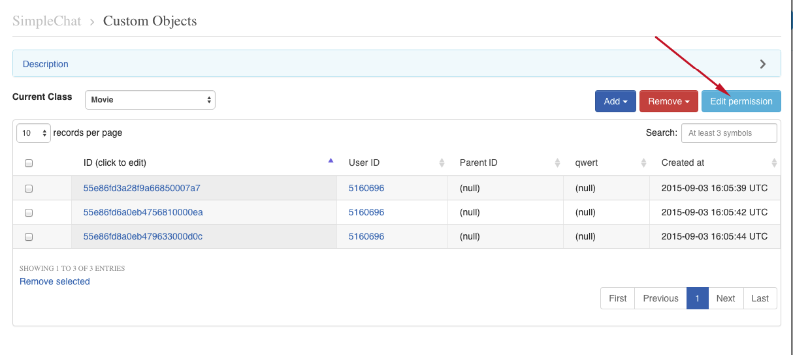
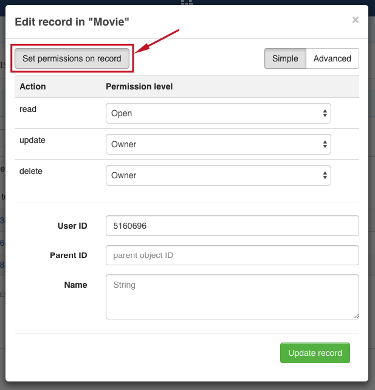
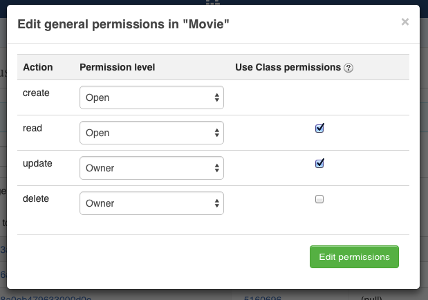

# Relations 
It is possible to create a relation between objects of two different classes  - via **_parent_id** field. 

For example, we have the class **Rating** that contains fields **Score**, **Review**, **Comment**. And we have the class **Movie**. So we can create a record of class **Rating** that will point to the record of the class **Movies** via its **_parent_id** field, so the **_parent_id** field will contain an ID of record from class **Movie**.

This is not a simple soft link. This is actually a hard link. When you delete the **Movie** class record then all its children (records of class **Rating** with **_parent_id** field set to the **Movie** class record ID) will be automatically deleted as well. 

If you need to retrieve all the children - you can retrieve records with the filter **_parent_id=<id_of_parent_class_record>**. 

# Permissions 
**Access control list (ACL)** is a list of permissions attached to some object. An ACL specifies which users have an access to objects, as well as what operations are allowed on given objects. Each entry in a typical ACL specifies a subject and an operation. ACL models may be applied to collections of objects as well as to individual entities within the system's hierarchy

In the QuickBlox user can **add the Access Control list only in the Custom objects module**.

## Permission scheme 
QuickBlox Permission scheme contains five permissions levels:

* **Open (open)**

Such permission schema means that any user within application can access to record/records in the class and is allowed to perform action with the current permission level

* **Owner (owner)**

Owner permission level means that only Owner (user who created a record) is allowed to perform action with the current permission level

* **Not allowed (not_allowed)**

No one (except the Account Administrator) can make the chosen action

* **Open for groups (open_for_groups)**

Users which have a specified tag / tags (see more info about how to set tags for user in Users module API) will be included in the group which is allowed to perform action with the current permission level. A current permission level can consist of one or several groups (number of groups is not limited). Tags can be added / deleted in the user’s profile.

* **Open for users ids (open_for_users_ids)**

Only users that are specified in the permission level can make a required action with a record. One or several users can be specified (number of users isn’t limited) 

 

**Actions available for the entity**:

* **Create**

Creation a record

* **Read**

Retrieving and reading the info about the chosen record
    
* **Update**

Updating any parameter for the chosen record (only those parameters that can be set by the user can be updated)

* **Delete**

Deleting a record 

## Permission levels 
There are two levels of access which QuickBlox is provided in such Permissions scheme: **Class** and **Record**. 

### Class entity
Class is an entity that contains records. Only the Account Administrator (web panel) can create a class in the Custom object module and make all possible actions with it. Operations with **Class** entity are not allowed in API

All actions (Create, Read, Update and Delete) are available for the ‘Class’ entity and are applicable for all records in the class. Every action has the separate permission level available. The exception is a Create action that isn’t available for Owner permission level.

To set a permission schema for the Class go to the Custom objects module and open a required class. Click on **'Edit permissions'** button to open a class to edit, like so:

Default Class permission schema is using while creating a class:

* **Create**: Open
* **Read**: Open
* **Update**: Owner
* **Delete**: Owner 

You should mark checkboxes to enable Class permissions  

### Record entity
Record is an entity within the Class in the Custom Objects module that has it’s own permission levels. Creation of the record is available in the Web panel and in API (see Create a record request). All permission levels except **Not allowed** are available for the record and there are only three actions are available and applicable for the record: Read, Update and Delete.

Default Record permission scheme is using while creating a class:

* **Read**: Open
* **Update**: Owner
* **Delete**: Owner 

To set a permission levels open the required Class and click on the record to open it for edit, like so: 

## Choosing a permission schema
In the same time only ONE permission level can be applicable to the record: Сlass permission schema or Record permission schema. To apply the Class permission levels to ALL records in the class - tick the checkbox ‘Use Class permissions’ near the required Action in the Admin panel, like so:

 

**Note**: Using the Class permission schema means that Record permission schema won’t be affected on reсord.

In case when the Admin doesn’t tick the checkbox in the Admin panel user has a possibility to change the permission levels for every separate record in the table or create a new one with the ACL that the user requires.

## Edit record's permissions via API
You can edit record's permissions via API when create or update a particular record. Follow the **Create object** and **Update object** APIs.

# Tips and Tricks 

## Sort by _id field
According to the module description, the **_id** field contains info about object time creation (timestamp). It means that sorting on the **_id** field is roughly equivalent to sorting by **created_at** field, but works much faster because the **_id** field has a predefined database index.

Hence it is highly recommended to use sort by **_id** (e.g. sort_desc=_id) field instead of sort by **created_at** field: 

## 'skip' parameter performance
The **skip** parameter is often expensive because it requires the server to walk from the beginning of the class table to get the offset or skip position before beginning to return result. As offset increases, **skip** will become slower and more CPU intensive. With larger collections, **skip** may become IO bound.

Instead of using big value of **skip** try to improve your query. Maybe you don't need it. 