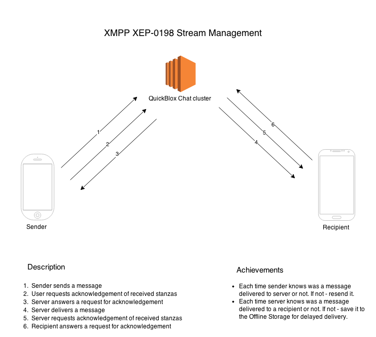

Real-time(XMPP) API is a quick and reliable solution which combines benefits of scalable cloud hosted XMPP chat server, seamless authorization and incoming IM / chat alerts. It's robust, quick and auto-scalable AWS powered cloud servers infrastructure. It's the best and most comprehensive solution so far to have your users communicate cross-platform. 

The following QuickBlox module are built on top of eal-time(XMPP) API:

* Text Chat (messaging) module
* Video Chat (calling) module

<br>
QuickBlox iOS, Android and Javascript SDKs use Real-time(XMPP) APIs.

<span id="XMPP_features_supported" class="on_page_navigation"></span>
# XMPP features supported
All standard XMPP libraries are supported (please check the list here [http://xmpp.org/xmpp-software/libraries](http://xmpp.org/xmpp-software/libraries)). All standard XEPs and the following additional ones (below) are supported: 

* RFC-6120 - [http://xmpp.org/rfcs/rfc6120.html](http://xmpp.org/rfcs/rfc6120.html) - Core: SSL/TLS stream encryption, SASL authentication, Resource binding etc
* RFC-6121 - [http://xmpp.org/rfcs/rfc6121.html](http://xmpp.org/rfcs/rfc6121.html) - Instant Messaging and Presence
* XEP-0016 - [http://xmpp.org/extensions/xep-0016.html](http://xmpp.org/extensions/xep-0016.html) - Privacy Lists
* XEP-0203 - [http://xmpp.org/extensions/xep-0203.html](http://xmpp.org/extensions/xep-0203.html) - Offline Message Storage
* XEP-0280 - [http://xmpp.org/extensions/xep-0280.html](http://xmpp.org/extensions/xep-0280.html) - Message Carbons
* XEP-0198 - [http://xmpp.org/extensions/xep-0198.html](http://xmpp.org/extensions/xep-0198.html) - Stream Management
* XEP-0085 - [http://xmpp.org/extensions/xep-0085.html](http://xmpp.org/extensions/xep-0085.html) - Chat State Notifications
* XEP-0079 - [http://xmpp.org/extensions/xep-0079.html](http://xmpp.org/extensions/xep-0079.html) - Advanced Message Processing
* XEP-0045 - [http://xmpp.org/extensions/xep-0045.html](http://xmpp.org/extensions/xep-0045.html) - Multi User Chat
* XEP-0047 - [http://xmpp.org/extensions/xep-0047.html](http://xmpp.org/extensions/xep-0047.html) - In-Band Bytestreams (p2p file transfer)
* XEP-0333 - [http://xmpp.org/extensions/xep-0333.html](http://xmpp.org/extensions/xep-0333.html) - Chat Markers
* XEP-0308 - [http://xmpp.org/extensions/xep-0308.html](http://xmpp.org/extensions/xep-0308.html) - Last Message Correction
* XEP-0174 - [http://xmpp.org/extensions/xep-0174.html](http://xmpp.org/extensions/xep-0174.html) - Serverless Messaging
* XEP-0237 - [http://xmpp.org/extensions/xep-0237.html](http://xmpp.org/extensions/xep-0237.html) - Roster Versioning
* XEP-0012 - [http://xmpp.org/extensions/xep-0012.html](http://xmpp.org/extensions/xep-0012.html) - Last Activity
* XEP-0352 - [http://xmpp.org/extensions/xep-0352.html](http://xmpp.org/extensions/xep-0352.html) - Client State Indication
* XEP-0202 - [http://xmpp.org/extensions/xep-0202.html](http://xmpp.org/extensions/xep-0202.html) - Entity Time
* XEP-0033 - [http://xmpp.org/extensions/xep-0033.html](http://xmpp.org/extensions/xep-0033.html) - Extended Stanza Addressing (not supported yet)
* XEP-0334 - [http://xmpp.org/extensions/xep-0334.html](http://xmpp.org/extensions/xep-0334.html) - Message Processing Hints (not supported yet)

XEP-0095 & XEP-0096 are not supported, instead QuickBlox own TURN server takes care of NAT traversal for voice and video traffic streaming. 

<span id="API_introduction" class="on_page_navigation"></span>
# API introduction
All XMPP API access is over TLS, and accessed via the **chat.quickblox.com:5223** domain. 

For Web applications it's also possible to use BOSH/WebSockets endpoints (**https://chat.quickblox.com:5281** and **wss://chat.quickblox.com:5291**).

<span id="Authenticating_requests" class="on_page_navigation"></span>
# Authenticating requests
In order to connect to Real-Time API you have to create a user. You can do it on [QuickBlox dashboard](https://admin.quickblox.com) or via Users REST API. Then you will user the user's login+password to authenticate via Real-Time API.

## Login / ID
Each user gets a JID (Jabber ID) in the following format:
 
```
<user_id>-<application_id>@chat.quickblox.com 
```

## Password
Your user’s password for XMPP connection depends on what type of user authentication you have applied for this particular user:

* Standard login+password authentication: use same password.
* Facebook/Twitter/Twitter Digits/Custom identity authentication: use QuickBlox session token as password.

<span id="Login_flow" class="on_page_navigation"></span>
# Handshake/Login Flow
Use this documentation to understand what the typical stanzas used in the QuickBlox XMPP handshake flow are.

**SASL Authentication Handshake Begin**

Client:

```xml
<open xmlns='urn:ietf:params:xml:ns:xmpp-framing' to='chat.quickblox.com' version='1.0'/>
```
Server:

```xml
<open xmlns='urn:ietf:params:xml:ns:xmpp-framing' from='chat.quickblox.com' id='e4b1d1be-45a9-4d1a-aea1-a5d17de4ecae' version='1.0' xml:lang='en' />
```
Server:

```xml
<stream:features xmlns:stream="http://etherx.jabber.org/streams">
  <sm xmlns="urn:xmpp:sm:3"/>
  <mechanisms xmlns="urn:ietf:params:xml:ns:xmpp-sasl">
    <mechanism>PLAIN</mechanism>
    <mechanism>ANONYMOUS</mechanism>
    <mechanism>PLAIN_FAST</mechanism>
  </mechanisms>
  <ver xmlns="urn:xmpp:features:rosterver"/>
  <starttls xmlns="urn:ietf:params:xml:ns:xmpp-tls"/>
  <compression xmlns="http://jabber.org/features/compress">
  	 <method>zlib</method>
  </compression>
</stream:features>
```

Client:

```xml
<auth xmlns='urn:ietf:params:xml:ns:xmpp-sasl' mechanism='PLAIN'>MjY5MDQ1OTQtMjk2NTBAY2hhdC5xdWlja2Jsb3guY29tADI2OTA0NTk0LTI5NjUwAGpzX2phc21pbmUyMjI=</auth>
```

Server:

```xml
<success xmlns="urn:ietf:params:xml:ns:xmpp-sasl"/>
```

**SASL Authentication Handshake End**

Client:

```xml
<open xmlns='urn:ietf:params:xml:ns:xmpp-framing' to='chat.quickblox.com' version='1.0'/>
```

Server:

```xml
<open xmlns='urn:ietf:params:xml:ns:xmpp-framing' from='chat.quickblox.com' id='e4b1d1be-45a9-4d1a-aea1-a5d17de4ecae' version='1.0' xml:lang='en' />
```

Server:

```xml
<stream:features xmlns:stream="http://etherx.jabber.org/streams">
  <sm xmlns="urn:xmpp:sm:3"/>
  <ver xmlns="urn:xmpp:features:rosterver"/>
  <starttls xmlns="urn:ietf:params:xml:ns:xmpp-tls"/>
  <compression xmlns="http://jabber.org/features/compress">
    <method>zlib</method>
  </compression>
  <bind xmlns="urn:ietf:params:xml:ns:xmpp-bind"/>
  <session xmlns="urn:ietf:params:xml:ns:xmpp-session"/>
</stream:features>
```

**Bind Resource Begin**

Client:

```xml
<iq type='set' id='_bind_auth_2' xmlns='jabber:client'><bind xmlns='urn:ietf:params:xml:ns:xmpp-bind'/></iq>
```

Server:

```xml
<iq to="26904594-29650@chat.quickblox.com/1571722472-quickblox-2386480" xmlns="jabber:client" type="result" id="_bind_auth_2"><bind xmlns="urn:ietf:params:xml:ns:xmpp-bind"><jid>26904594-29650@chat.quickblox.com/1571722472-quickblox-2386480</jid></bind></iq>
```

**Bind Resource End**

**Initial Presence Begin**

Client:

```xml
<presence xmlns='jabber:client'/>
```

Server:

```xml
<presence to="26904594-29650@chat.quickblox.com" from="26904594-29650@chat.quickblox.com/1571722472-quickblox-2386480" xmlns="jabber:client"/>
```

**Initial Presence End**

<span id="XML_stanza_formats" class="on_page_navigation"></span>
# XML stanza formats
QuickBlox Real-time API is based on origin XMPP standards, but with slighty changes. Here we list the XML stanzas formats for every modified feature.

## Send/Receive chat message 

A message's **type** attribute can be **chat** or **groupchat**:.

* **chat** is used for 1-1 messages. 
* **groupchat** is used for 1-1 messages. 

**1-1 message:**

```xml
<message id="53fc4604565c128132016612" to="26904594-29650@chat.quickblox.com" type="chat">
	<body xmlns="jabber:client">This is 1-1 message!</body>
	<extraParams xmlns="jabber:client">
		<save_to_history>1</save_to_history>
		<date_sent>1409146118</date_sent>
	</extraParams>
</message>
```

**group chat message:**

```xml
<message id="53ac4604565c128132016614" to="11492_53fc460b515c128132016675@muc.chat.quickblox.com" type="groupchat">
	<body xmlns="jabber:client">This is group chat message!</body>
	<extraParams xmlns="jabber:client">
		<save_to_history>1</save_to_history>
		<date_sent>1409146118</date_sent>
	</extraParams>
</message>
```

QuickBlox introduces a very simple server-side chat history functionality. This features is useful for many cases such as moderation, restoring messages on a new device via REST, making chat logs be easily downloadable, etc. We (Quickblox) are not able to read your messages - only you, as the account owner, have access to them.

Just by adding a custom parameters **save_to_history** to your XMPP messages, the messages will be stored on the server.

You'll notice there's also a **date_sent** field in the extra parameters. This is optional - if you don't supply it, the server will automatically add it when it receives the message. But if for example, you need to "resend" a message that failed, you can use this field to specify the correct time. It is in a unix timestamp format.

**receive message format:**

```xml
<message xmlns="jabber:client" from="92_54789d40535c12b1a5001172@muc.chat.quickblox.com/1501966" to="1501966-92@chat.quickblox.com/0C1E1229-6B3C-47F3-BFDC-D1CFD351D274" type="groupchat" id="54789d5e6df5e6f921b7acda">
    <body>Nice to met you!</body>
    <extraParams xmlns="jabber:client">
        <save_to_history>1</save_to_history>
        <date_sent>1409146118</date_sent>
        <dialog_id>54789d40535c12b1a5001172</dialog_id>
    </extraParams>
</message>
```

As you can see, server automatically adds a **dialog_id** extra parameter so a recipient knows to which chat dialog this message relates.

## File attachments
Each attachment should be included into **extraParams** part of a message.

Each attachment contains the following attributes:

* type - type of the attachment. Could be any. Recommended values: image, video, audio, location.
* id (optional)- a link to a file, for example ID of a file in Content or Custom Objects modules
* url (optional) - an url to file in the Internet
* data (optional) - an attachment's data. For example, used for location attachments to pass lat & lon.
* size (optional) - size of file
* width (optional) - if attachment is an image - an image's width
* height (optional) - if attachment is an image - an image's height
* duration (optional) - if attachment is an audio/video - an image's height
* content-type (optional) - an attachment's content type
* name (optional) - an attachment's name

```xml
<message id="546dbf438c54ad2aded63b25" type="groupchat" to="2_546d14c19c29532398000496@muc.chat.quickblox.com">
    <body>Nice to met you!</body>
    <extraParams xmlns="jabber:client">
        <save_to_history>1</save_to_history>
        <attachment type="video" id="47863" duration="894"></attachment>
        <attachment type="image" id="123123" width="640" height="480"></attachment>
        <attachment type="audio" id="323232" duration="365"></attachment>
        <attachment type="location" data="{&quot;lat&quot;:50.01383403152402,&quot;lng&quot;:36.22868299484253}"></attachment>
    </extraParams>
</message>
```

## 'Is typing' status

A **type** can be **chat** or **groupchat**, so you can send 'is typing' statuses in 1-1 or group chats.

**composing:**

```xml
<message id="55e416e3854516bc190041a8" type="chat" to="4374458-92@chat.quickblox.com">
    <composing xmlns="http://jabber.org/protocol/chatstates"/>
</message>
```

**paused:**

```xml
<message id="55e4175a854516bc190041a9" type="chat" to="4374458-92@chat.quickblox.com">
    <paused xmlns="http://jabber.org/protocol/chatstates"/>
</message>
```

## 'Delivered' status
A **type** can be **chat** only, so you send 'delivered' statuses directly to users.

```xml
<message to="2308497-92@chat.quickblox.com" type="chat" id="55e821cd0ce78744090041b2">
    <received xmlns="urn:xmpp:chat-markers:0" id="55e818f6e24a0998640041ed"/>
    <extraParams xmlns="jabber:client">
        <dialog_id>55e6a9c8a28f9a3ea6001f15</dialog_id>
    </extraParams>
</message>
```

## 'Read' status
A **type** can be **chat** only, so you send 'read' statuses directly to users.

```xml
<message to="2308497-92@chat.quickblox.com" type="chat" id="55e821cd0ce78744090041b2">
    <displayed xmlns="urn:xmpp:chat-markers:0" id="55e818f6e24a0998640041ed"/>
    <extraParams xmlns="jabber:client">
        <dialog_id>55e6a9c8a28f9a3ea6001f15</dialog_id>
    </extraParams>
</message>
```

## System messages
There is a special channel for any system notifications. The end user can use it to split regular chat messages and other system events.

All such messages should contain **extraParams.moduleIdentifier=SystemNotifications** and use **type=headline**.

You can send system messages directly to user only (grou chat is not supported).

```xml
<message id="..." type="headline" to="...@chat.quickblox.com">
    <extraParams xmlns="jabber:client">
        <moduleIdentifier>SystemNotifications</moduleIdentifier>
        <param1>value1</param1>
        <param2>value2</param2>
        ...
    </extraParams>
</message>
```

# Stream management
Stream management ([XEP-0198](http://xmpp.org/extensions/xep-0198.html)) defines an XMPP protocol extension for active management of a stream between two users, including features for stanza acknowledgements and stream resumption. This protocol aims to resolve the issue with lost messages in a case of very poor Internet connection.

The basic concept behind stream management is that the initiating entity (a client) and the receiving entity (a server) can exchange "commands" for active management of the stream. The following stream management features are of particular interest because they are expected to improve network reliability and the end-user experience:

* Stanza Acknowledgements -- the ability to know if a stanza or series of stanzas has been received by one's peer.
* Stream Resumption -- the ability to quickly resume a stream that has been terminated.

The main interesting part here is **Stanza Acknowledgements** because it allows to achieve 100% reliability. To better understand how it works we prepared the follosing picture:


 
<span id="Changelog" class="on_page_navigation"></span>
# Changelog

## Real-time(XMPP) API changelog
TBA
